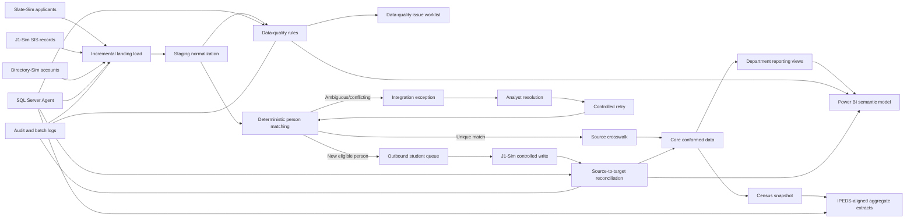

# Campus Data Operations & Compliance Hub

## Direct recommendation

Build **Campus Data Operations & Compliance Hub**, a production-style higher-education data platform that simulates the exact work this contract requires: recurring reports, a Slate-to-SIS applicant integration, deterministic record matching, exception reconciliation, data-quality controls, IPEDS-aligned extracts, role-based access, performance tuning, automated scheduling, tests, and operating documentation.

This should be presented as an **independent portfolio simulation built with synthetic data**, not as an RCC system and not as real experience administering Jenzabar or Slate. That distinction preserves credibility while still proving that the underlying SQL, integration, reporting, security, troubleshooting, and documentation skills transfer directly to the job.

The design intentionally matches the environment described in the posting. Jenzabar’s SIS supports functions such as billing, registration, course management, and institution-wide student information, while Slate supports bidirectional integration with Jenzabar and other SIS platforms through scheduled web services, file transfers, or APIs. SQL Database Projects make the schema buildable and deployable as a versioned artifact, and SQL Server Agent provides scheduled jobs with steps, status history, alerts, and on-demand execution.[^1][^2][^3][^4][^5][^6]

## Project identity

**Project name:** Campus Data Operations & Compliance Hub  
**Repository name:** `campus-data-ops-hub`  
**One-line pitch:** A SQL Server platform that integrates synthetic admissions, student-information, identity, financial-aid, and student-account data; resolves failed records; validates institutional metrics; and publishes secure, documented reports to Power BI.

### Business scenario

A fictional Massachusetts community college uses:

- **Slate-Sim** as its admissions CRM.
- **J1-Sim** as its transactional student information system.
- **Directory-Sim** as an Active Directory-style identity source.
- **CampusDataOps** as the integration, reconciliation, reporting, and audit database.
- **Power BI** as the operational and leadership reporting layer.

The admissions office needs accepted applicants transferred into the SIS every night. Some records fail because of missing program codes, duplicate people, conflicting IDs, malformed contact data, closed academic terms, or ambiguous identity matches. Meanwhile, Enrollment, Financial Aid, Student Accounts, Academic Affairs, and Institutional Research need recurring extracts whose counts can be traced to source records and reproduced for a specific reporting date.

### Final outcome

The finished system will:

- Load incremental source data into immutable landing tables.
- Standardize applicants, students, addresses, terms, programs, enrollments, awards, balances, credentials, and directory accounts.
- Match Slate applicants to SIS people using explainable deterministic rules.
- Auto-process only confident matches and create managed exceptions for uncertain records.
- Detect duplicates, omissions, invalid references, cross-system conflicts, and reconciliation differences.
- Publish department-specific views, stored procedures, CSV extracts, and a Power BI model.
- Produce IPEDS-aligned mock extracts for Fall Enrollment, 12-Month Enrollment, Completions, and Student Financial Aid.
- Protect student and financial fields with least-privilege roles, masked reporting views, encryption configuration, and access logging.
- Record every batch, row count, rejected record, validation result, job duration, and rerun.
- Include execution-plan evidence showing how selected slow queries were tuned.
- Deploy from a SQL project and run automated database and Python tests in CI.
- Leave behind runbooks, a data dictionary, source-to-target mappings, report specifications, recovery procedures, and an AI-verification log.

IPEDS is not one generic annual file; NCES operates 12 interconnected survey components over fall, winter, and spring collections, including enrollment, completions, financial aid, graduation, finance, and human resources. Therefore, this project should implement a few carefully documented, **IPEDS-aligned mock extracts**, rather than falsely claiming to reproduce every official submission rule.[^7][^8][^9]

## Technology stack

| Layer | Technology | Project use |
|---|---|---|
| Database engine | SQL Server 2022 Developer Edition | Transactional simulators, integration database, marts, Query Store, security, and SQL Agent |
| SQL language | T-SQL | Complex joins, CTEs, window functions, set-based matching, aggregates, views, procedures, functions, permissions, and tuning |
| Database development | SDK-style SQL Database Projects or SSDT, `.sqlproj`, SqlPackage | Versioned schema, build validation, DACPAC deployment, publish profiles, and CI/CD; a SQL project represents tables, views, procedures, and other objects locally and builds a deployable DACPAC.[^5][^10] |
| SQL administration | SSMS | Execution plans, Query Store analysis, Agent jobs, permissions, and troubleshooting |
| Integration | Python 3.12, `pyodbc`, `pandas`, `pydantic-settings` | Synthetic source generation, API/file simulation, controlled bulk loads, extract delivery, and orchestration helpers |
| Scheduling | SQL Server Agent plus optional PowerShell wrapper | Nightly integration, morning reports, weekly quality scans, retries, alerts, and job history; Agent supports T-SQL, PowerShell, command-line, and SSIS-style steps.[^1][^2] |
| Reporting | Power BI Desktop | Enrollment, exceptions, data quality, financial aid, student accounts, and job health dashboards |
| Database testing | tSQLt | Unit tests for matching, transformations, duplicate detection, report logic, and permissions; tSQLt runs tests inside transactions and supports fake tables and procedure spies.[^11] |
| Python testing | `pytest` | Tests for generators, extract schemas, row-count controls, file naming, and idempotent reruns |
| Code quality | SQLFluff with T-SQL dialect, Ruff, Black, pre-commit | Consistent SQL and Python formatting and linting |
| Containers | Docker Compose | Reproducible local SQL Server and integration runtime |
| Version control | Git and GitHub | Feature branches, pull requests, tagged releases, issues, and change history |
| CI | GitHub Actions | Build SQL project, lint SQL/Python, run Python tests, deploy an ephemeral test database, and run tSQLt |
| Documentation | Markdown, Mermaid, dbdiagram or Draw.io | Architecture, lineage, ERD, data dictionary, runbooks, ADRs, and flow diagrams |
| Secrets | `.env` locally and GitHub Secrets in CI | Connections and service credentials; never commit secrets |
| Optional cloud extension | Google Cloud SQL for SQL Server and Cloud Storage | Demonstrates cloud-hosted database and secure extract delivery without making cloud deployment a blocker |
| AI assistance | Claude or equivalent, documented in `docs/ai/` | Drafting and review only; every accepted output must have human review, tests, and evidence |

### Why this stack

Use SQL Server rather than PostgreSQL because the role explicitly values strong T-SQL or PL/SQL and asks for execution-plan tuning. Query Store records query text, plan history, runtime statistics, and wait statistics, which makes it suitable for documenting before-and-after performance work. Execution plans show table access order, access methods, joins, filtering, aggregation, and sorting, so the tuning evidence should discuss those operators rather than merely saying that a query became “faster.”[^12][^13][^14]

Use Power BI because it is listed as a preferred reporting tool and fits your existing SQL, analytics, and Power BI experience. Configure incremental refresh only after the basic semantic model works; Power BI partitions tables by date and refreshes only the configured recent period after the initial load.[^15][^16]

## System boundaries

### Simulated source systems

**Slate-Sim** contains prospect and applicant workflow data:

- `Person`
- `Application`
- `ApplicationStatusHistory`
- `ApplicationProgram`
- `Address`
- `ContactPoint`
- `ExternalIdentifier`
- `ExportQueue`

**J1-Sim** contains authoritative post-admission operational data:

- `Person`
- `Student`
- `AcademicTerm`
- `AcademicProgram`
- `CourseSection`
- `Enrollment`
- `FinalGrade`
- `FinancialAidAward`
- `StudentAccountTransaction`
- `CredentialAwarded`

**Directory-Sim** contains identity data:

- `DirectoryAccount`
- `GroupMembership`
- `AccountStatusHistory`

The names model business concepts but must not copy proprietary schemas. Include a visible disclaimer in the README: “J1-Sim and Slate-Sim are original educational models created from public product descriptions and do not reproduce proprietary vendor schemas, code, or confidential institutional data.”

### Operations database

Use a single `CampusDataOps` database divided into schemas:

| Schema | Responsibility |
|---|---|
| `landing` | Append-only snapshots exactly as received, with batch metadata |
| `staging` | Typed, standardized, deduplicated records ready for business rules |
| `core` | Conformed person, applicant, student, term, program, enrollment, award, and account entities |
| `integration` | Crosswalks, match candidates, outbound queues, exceptions, and reconciliation |
| `dq` | Rules, validation runs, failures, severity, ownership, and resolution |
| `reporting` | Stable department-facing views and parameterized report procedures |
| `compliance` | Census snapshots, measure definitions, control totals, and IPEDS-aligned extracts |
| `security` | Access mappings, masking helpers, and permission metadata |
| `audit` | Batch execution, row lineage, job events, access events, and change history |
| `reference` | Term, program, status, source-system, rejection-reason, and code mappings |

This separation prevents reports from querying raw source tables directly and makes lineage understandable: source → landing → staging → core → reporting/compliance.

## Repository structure

```text
campus-data-ops-hub/
├── README.md
├── LICENSE
├── SECURITY.md
├── CONTRIBUTING.md
├── CHANGELOG.md
├── .editorconfig
├── .env.example
├── .gitignore
├── .pre-commit-config.yaml
├── pyproject.toml
├── docker-compose.yml
├── Makefile
├── CampusDataOps.sln
│
├── database/
│   ├── CampusDataOps.Database/
│   │   ├── CampusDataOps.Database.sqlproj
│   │   ├── Pre-Deployment.sql
│   │   ├── Post-Deployment.sql
│   │   ├── landing/
│   │   │   ├── Tables/
│   │   │   │   ├── SlateApplicantRaw.sql
│   │   │   │   ├── SlateApplicationRaw.sql
│   │   │   │   ├── J1PersonRaw.sql
│   │   │   │   ├── J1EnrollmentRaw.sql
│   │   │   │   ├── J1FinancialAidRaw.sql
│   │   │   │   └── DirectoryAccountRaw.sql
│   │   │   └── StoredProcedures/
│   │   │       ├── usp_BeginLandingBatch.sql
│   │   │       └── usp_EndLandingBatch.sql
│   │   ├── staging/
│   │   │   ├── Tables/
│   │   │   │   ├── Applicant.sql
│   │   │   │   ├── Person.sql
│   │   │   │   ├── Enrollment.sql
│   │   │   │   ├── FinancialAidAward.sql
│   │   │   │   └── DirectoryAccount.sql
│   │   │   ├── Views/
│   │   │   │   ├── vw_NormalizedApplicant.sql
│   │   │   │   └── vw_NormalizedPerson.sql
│   │   │   └── StoredProcedures/
│   │   │       ├── usp_StageSlateApplicants.sql
│   │   │       ├── usp_StageJ1Students.sql
│   │   │       └── usp_StageDirectoryAccounts.sql
│   │   ├── core/
│   │   │   ├── Tables/
│   │   │   │   ├── Person.sql
│   │   │   │   ├── Applicant.sql
│   │   │   │   ├── Student.sql
│   │   │   │   ├── AcademicTerm.sql
│   │   │   │   ├── AcademicProgram.sql
│   │   │   │   ├── CourseSection.sql
│   │   │   │   ├── Enrollment.sql
│   │   │   │   ├── FinancialAidAward.sql
│   │   │   │   ├── AccountTransaction.sql
│   │   │   │   └── CredentialAwarded.sql
│   │   │   ├── Views/
│   │   │   │   └── vw_CurrentStudent.sql
│   │   │   └── StoredProcedures/
│   │   │       ├── usp_UpsertApplicant.sql
│   │   │       ├── usp_UpsertStudent.sql
│   │   │       └── usp_ApplyEnrollmentChanges.sql
│   │   ├── integration/
│   │   │   ├── Tables/
│   │   │   │   ├── SourceCrosswalk.sql
│   │   │   │   ├── MatchCandidate.sql
│   │   │   │   ├── IntegrationException.sql
│   │   │   │   ├── ExceptionAction.sql
│   │   │   │   ├── OutboundStudentQueue.sql
│   │   │   │   └── ReconciliationResult.sql
│   │   │   ├── Functions/
│   │   │   │   ├── fn_NormalizeName.sql
│   │   │   │   └── fn_NormalizeEmail.sql
│   │   │   ├── Views/
│   │   │   │   ├── vw_OpenExceptionWorklist.sql
│   │   │   │   └── vw_UnmatchedApplicants.sql
│   │   │   └── StoredProcedures/
│   │   │       ├── usp_BuildApplicantMatchCandidates.sql
│   │   │       ├── usp_ResolveDeterministicMatches.sql
│   │   │       ├── usp_CreateIntegrationExceptions.sql
│   │   │       ├── usp_QueueAcceptedApplicants.sql
│   │   │       ├── usp_ProcessOutboundQueue.sql
│   │   │       ├── usp_ReconcileSlateToJ1.sql
│   │   │       └── usp_RetryResolvedExceptions.sql
│   │   ├── dq/
│   │   │   ├── Tables/
│   │   │   │   ├── Rule.sql
│   │   │   │   ├── ValidationRun.sql
│   │   │   │   ├── RuleResult.sql
│   │   │   │   └── IssueDisposition.sql
│   │   │   ├── Views/
│   │   │   │   ├── vw_CurrentDataQualityIssues.sql
│   │   │   │   └── vw_DataQualityScorecard.sql
│   │   │   └── StoredProcedures/
│   │   │       ├── usp_RunDataQualitySuite.sql
│   │   │       ├── usp_CheckDuplicatePeople.sql
│   │   │       ├── usp_CheckEnrollmentIntegrity.sql
│   │   │       └── usp_CheckCrossSystemConsistency.sql
│   │   ├── reporting/
│   │   │   ├── Views/
│   │   │   │   ├── vw_EnrollmentCensus.sql
│   │   │   │   ├── vw_FinancialAidPackaging.sql
│   │   │   │   ├── vw_StudentAccountAging.sql
│   │   │   │   ├── vw_AcademicProgress.sql
│   │   │   │   ├── vw_ApplicantFunnel.sql
│   │   │   │   └── vw_LeadershipKPI.sql
│   │   │   └── StoredProcedures/
│   │   │       ├── usp_ReportEnrollmentByTerm.sql
│   │   │       ├── usp_ReportAidByAcademicYear.sql
│   │   │       ├── usp_ReportAccountAging.sql
│   │   │       └── usp_ReportAcademicOutcomes.sql
│   │   ├── compliance/
│   │   │   ├── Tables/
│   │   │   │   ├── CensusSnapshot.sql
│   │   │   │   ├── MeasureDefinition.sql
│   │   │   │   ├── ExtractRun.sql
│   │   │   │   └── ExtractControlTotal.sql
│   │   │   ├── Views/
│   │   │   │   ├── vw_IPEDS_FallEnrollment.sql
│   │   │   │   ├── vw_IPEDS_12MonthEnrollment.sql
│   │   │   │   ├── vw_IPEDS_Completions.sql
│   │   │   │   └── vw_IPEDS_StudentFinancialAid.sql
│   │   │   └── StoredProcedures/
│   │   │       ├── usp_CaptureCensusSnapshot.sql
│   │   │       ├── usp_GenerateIPEDSExtract.sql
│   │   │       └── usp_ValidateExtractControlTotals.sql
│   │   ├── security/
│   │   │   ├── Functions/fn_UserDataScope.sql
│   │   │   ├── SecurityPolicies/StudentDataPolicy.sql
│   │   │   ├── Views/vw_StudentMasked.sql
│   │   │   ├── Roles/DatabaseRoles.sql
│   │   │   └── Grants/RolePermissions.sql
│   │   ├── audit/
│   │   │   ├── Tables/
│   │   │   │   ├── BatchRun.sql
│   │   │   │   ├── BatchStep.sql
│   │   │   │   ├── RowLineage.sql
│   │   │   │   ├── AccessEvent.sql
│   │   │   │   └── ErrorLog.sql
│   │   │   └── StoredProcedures/
│   │   │       ├── usp_LogBatchStart.sql
│   │   │       ├── usp_LogBatchEnd.sql
│   │   │       └── usp_LogError.sql
│   │   ├── reference/
│   │   │   ├── Tables/
│   │   │   │   ├── SourceSystem.sql
│   │   │   │   ├── AcademicTerm.sql
│   │   │   │   ├── ProgramCrosswalk.sql
│   │   │   │   └── ExceptionReason.sql
│   │   │   └── Seed/reference_seed.sql
│   │   └── Scripts/
│   │       ├── enable_query_store.sql
│   │       ├── create_agent_proxy.sql
│   │       └── smoke_test.sql
│   │
│   ├── SourceSystems.Database/
│   │   ├── SourceSystems.Database.sqlproj
│   │   ├── SlateSim/Tables/
│   │   ├── J1Sim/Tables/
│   │   └── DirectorySim/Tables/
│   │
│   └── CampusDataOps.Tests/
│       ├── CampusDataOps.Tests.sqlproj
│       ├── MatchTests/
│       │   ├── test_exact_external_id_match.sql
│       │   ├── test_email_dob_match.sql
│       │   ├── test_ambiguous_match_creates_exception.sql
│       │   └── test_rerun_does_not_duplicate_student.sql
│       ├── DataQualityTests/
│       ├── ReportingTests/
│       ├── ComplianceTests/
│       └── SecurityTests/
│
├── pipelines/
│   ├── campus_ops/
│   │   ├── __init__.py
│   │   ├── config.py
│   │   ├── db.py
│   │   ├── logging_config.py
│   │   ├── batch.py
│   │   ├── watermarks.py
│   │   ├── loaders/
│   │   │   ├── slate_loader.py
│   │   │   ├── j1_loader.py
│   │   │   └── directory_loader.py
│   │   ├── generators/
│   │   │   ├── people.py
│   │   │   ├── academics.py
│   │   │   ├── financial_aid.py
│   │   │   ├── student_accounts.py
│   │   │   └── edge_cases.py
│   │   ├── extracts/
│   │   │   ├── enrollment.py
│   │   │   ├── financial_aid.py
│   │   │   └── ipeds.py
│   │   └── cli.py
│   └── scripts/
│       ├── generate_synthetic_sources.py
│       ├── run_nightly_integration.py
│       ├── export_recurring_reports.py
│       └── reconcile_batch.py
│
├── automation/
│   ├── sql-agent/
│   │   ├── 01_create_nightly_integration_job.sql
│   │   ├── 02_create_recurring_reports_job.sql
│   │   ├── 03_create_weekly_dq_job.sql
│   │   └── 04_create_alerts_operators.sql
│   └── powershell/
│       ├── Invoke-CampusPipeline.ps1
│       ├── Publish-Extract.ps1
│       └── Test-Environment.ps1
│
├── powerbi/
│   ├── CampusDataOps.pbip/
│   │   ├── CampusDataOps.Report/
│   │   └── CampusDataOps.SemanticModel/
│   ├── dax/
│   │   ├── Measures.dax
│   │   └── RLS-Roles.md
│   ├── themes/campus-theme.json
│   └── screenshots/
│
├── tests/
│   ├── python/
│   │   ├── test_generators.py
│   │   ├── test_loader_idempotency.py
│   │   ├── test_extract_contracts.py
│   │   └── test_reconciliation_controls.py
│   ├── fixtures/
│   │   ├── minimal_valid_batch.json
│   │   ├── duplicate_person_batch.json
│   │   └── ambiguous_match_batch.json
│   └── contracts/
│       ├── slate_applicant.schema.json
│       └── enrollment_extract.schema.json
│
├── performance/
│   ├── baselines/
│   ├── actual-plans/
│   ├── optimized-plans/
│   ├── queries/
│   │   ├── enrollment_report_before.sql
│   │   ├── enrollment_report_after.sql
│   │   ├── duplicate_detection_before.sql
│   │   └── duplicate_detection_after.sql
│   └── PERFORMANCE-REPORT.md
│
├── docs/
│   ├── architecture/
│   │   ├── system-context.md
│   │   ├── container-diagram.md
│   │   ├── data-flow.md
│   │   ├── erd.md
│   │   └── security-model.md
│   ├── specifications/
│   │   ├── business-glossary.md
│   │   ├── source-to-target-mapping.md
│   │   ├── matching-rules.md
│   │   ├── data-quality-rules.md
│   │   ├── report-catalog.md
│   │   └── ipeds-measure-mapping.md
│   ├── runbooks/
│   │   ├── nightly-integration.md
│   │   ├── exception-reconciliation.md
│   │   ├── recurring-report-production.md
│   │   ├── failed-job-recovery.md
│   │   ├── access-request.md
│   │   └── deployment-rollback.md
│   ├── decisions/
│   │   ├── ADR-001-deterministic-matching.md
│   │   ├── ADR-002-append-only-landing.md
│   │   └── ADR-003-census-snapshots.md
│   ├── ai/
│   │   ├── AI-USAGE-POLICY.md
│   │   ├── PROMPT-LOG.md
│   │   └── VERIFICATION-LOG.md
│   ├── demos/
│   │   ├── DEMO-SCRIPT.md
│   │   └── INTERVIEW-TALK-TRACK.md
│   ├── DATA-DICTIONARY.md
│   └── OPERATIONS-HANDBOOK.md
│
├── sample-output/
│   ├── redacted-extracts/
│   ├── reconciliation/
│   └── reports/
│
└── .github/
    ├── workflows/
    │   ├── validate.yml
    │   ├── database-ci.yml
    │   └── release-dacpac.yml
    ├── pull_request_template.md
    └── ISSUE_TEMPLATE/
        ├── bug.yml
        └── report-request.yml
```

Do not create every empty file on day one. Establish this target structure, then add files only when each implementation part requires them. The repository should always run at the end of each part.

## Core data design

### Batch identity and lineage

Every inbound row receives:

- `BatchId`: unique identifier for one source load.
- `SourceSystemCode`: `SLATE_SIM`, `J1_SIM`, or `DIRECTORY_SIM`.
- `SourceRecordId`: immutable source key.
- `SourceUpdatedAt`: source timestamp.
- `IngestedAt`: platform timestamp.
- `RecordHash`: hash of relevant business columns.
- `SourceFileName` or `RequestId`.
- `IsCurrent`: only if a history pattern requires it.

`audit.BatchRun` records requested start time, actual start and end, status, invoking user/service, source watermark, rows read, inserted, updated, unchanged, rejected, and exception count. A rerun with the same batch and row hash must not create duplicate students, exceptions, or outbound messages.

### Matching hierarchy

Use deterministic, explainable rules rather than opaque fuzzy matching:

| Priority | Rule | Action |
|---|---|---|
| 1 | Existing source crosswalk | Auto-match |
| 2 | Exact institutional/student ID | Auto-match if unique |
| 3 | Exact normalized email + date of birth | Auto-match if unique |
| 4 | Exact normalized legal name + date of birth + postal code | Candidate requiring review unless institutional policy explicitly approves auto-match |
| 5 | Multiple candidates satisfy a rule | Create `AMBIGUOUS_MATCH` exception |
| 6 | No candidate | Create new-person candidate or `NO_MATCH` exception based on application status |
| 7 | Conflicting immutable identifiers | Block and create `IDENTITY_CONFLICT` exception |

Store the rule code, candidate count, evidence fields, confidence category, decision, decision maker, and decision timestamp. Do not hide business decisions inside a scalar function or Python script.

### Exception lifecycle

Use these statuses: `OPEN`, `ASSIGNED`, `AWAITING_SOURCE_CORRECTION`, `RESOLVED`, `RETRY_READY`, `REPROCESSED`, and `CLOSED`. Each transition writes an `ExceptionAction` row with the previous status, new status, reason, user, time, and optional note.

Required exception categories include:

- Missing required name, birth date, term, or program.
- Invalid or inactive program code.
- Closed or unknown entry term.
- Duplicate Slate application.
- Duplicate SIS person.
- Ambiguous person match.
- Conflicting institutional identifiers.
- Invalid email or phone format.
- Applicant already matriculated.
- Outbound SIS write failure.
- Cross-system status mismatch.
- Missing directory account for active student.
- Orphan directory account.
- Reconciliation count mismatch.

### Data-quality rules

Make rules metadata-driven. `dq.Rule` should contain the rule code, description, entity, severity, owner department, effective date, active flag, expected condition, and remediation guidance. Procedures execute rule logic and write one row per failed record to `dq.RuleResult`.

Include tests for:

- Required fields.
- Accepted domains and formats.
- Duplicate natural keys.
- Referential integrity not already guaranteed by constraints.
- Mutually inconsistent status combinations.
- Invalid term and program references.
- Enrollment without a student.
- Aid without an eligible academic period.
- Credentials before program completion.
- Active students without active directory identities.
- Financial transactions whose detail does not reconcile to account totals.
- Integration rows missing source-to-target crosswalks.

### Reporting contracts

Each report requires a specification before code:

- Business owner and audience.
- Purpose and decision supported.
- Parameters and default values.
- Grain: one row per what?
- Included and excluded populations.
- Census date or as-of behavior.
- Definition of every measure.
- Source-to-target lineage.
- Security classification.
- Refresh schedule and delivery format.
- Control totals and acceptance criteria.
- Known limitations.

This is how the project demonstrates the posting’s requirement to translate a nontechnical request into a precise specification and surface unstated requirements.

## Reports and dashboard

### Recurring SQL outputs

Build at least six production-style outputs:

1. **Enrollment Census Extract:** one row per student-term-program with credit load, full-/part-time classification, residency category, and census inclusion flag.
2. **Financial Aid Packaging Report:** one row per student-award-year-fund with offered, accepted, disbursed, cancelled, and remaining amounts.
3. **Student Account Aging Report:** one row per student with current, 1–30, 31–60, 61–90, and 90+ day balances.
4. **Academic Progress Report:** attempted and earned credits, term GPA, cumulative GPA, academic standing, and completion markers.
5. **Applicant Integration Exception Worklist:** exception reason, applicant, source values, candidate matches, age, owner, status, and permitted action.
6. **Leadership KPI Dataset:** application funnel, yield, census enrollment, credit load, aid recipients, outstanding balances, course success, and completion counts.

### Power BI pages

| Page | Primary content |
|---|---|
| Executive Overview | Applicant-to-enrollment funnel, census headcount, FTE-style credit metric, course success, awards, and trend selectors |
| Enrollment | Headcount by term, program, attendance intensity, new/continuing status, and census date |
| Integration Operations | Processed, matched, created, rejected, open exceptions, aging, retries, and reconciliation variance |
| Data Quality | Failures by rule, source, severity, owner, age, and recurring record |
| Financial Aid | Offered, accepted, disbursed, recipients, and unresolved eligibility/data issues |
| Student Accounts | Outstanding balance, aging bucket, transaction trend, and reconciliation status |
| Job Health | Batch duration, job outcome, processed rows, failed step, and last successful run |

Do not display names, birth dates, addresses, personal email, student IDs, or detailed financial records on public screenshots. Use aggregate visuals or clearly fake masked identifiers.

## Compliance and security

FERPA education records include grades, transcripts, schedules, postsecondary student financial information, and other records directly related to a student. FERPA does not mean every employee may access every record; disclosure without consent to school officials depends on legitimate educational interest. Title IV institutions are also subject to GLBA data-security requirements, and Department of Education guidance states that student financial-aid information must be protected from unauthorized access or disclosure.[^17][^18][^19][^20][^21]

Implement these controls:

- Custom database roles: `role_integration_service`, `role_enrollment_reporter`, `role_financial_aid_reporter`, `role_student_accounts_reporter`, `role_ir_analyst`, `role_security_admin`, and `role_auditor`.
- Grant access to curated views and procedures, not source and landing tables.
- Deny broad ad hoc access to birth dates, personal contact information, government identifiers, and row-level financial details.
- Use masked reporting views for demos.
- Encrypt connections and document TDE/backup-encryption configuration even if local Developer Edition limits the final deployment scenario.
- Store secrets outside the repository.
- Log extract execution and privileged access.
- Add retention notes and a safe sample-data policy.
- Use a separate Power BI security model for imported datasets; do not assume database row-level security automatically carries into every Power BI storage mode.

SQL Server supports row-level security through security policies and inline table-valued predicate functions; filter predicates limit readable rows and block predicates prevent unauthorized writes. Microsoft recommends combining row-level security with encryption or dynamic data masking where appropriate. The project should demonstrate these tools selectively, not apply them everywhere merely to list more features.[^22][^23]

## Four-part build plan

## Part 1 — Foundation and sources

### Goal

Create a reproducible SQL Server environment, the synthetic source systems, the operations database, baseline schemas, seed data, deployment workflow, and architectural documentation.

### Deliverables

- Docker Compose environment with health checks.
- `SourceSystems.Database` and `CampusDataOps.Database` SQL projects.
- Synthetic data generator with a fixed seed and clearly fake domains.
- Core reference tables and source-to-target map.
- Batch/audit framework.
- Initial ERD and architecture diagrams.
- CI that builds both SQL projects and runs Python lint/tests.
- One-command setup such as `make bootstrap` and one-command smoke test.

### Acceptance criteria

- A clean clone can start SQL Server, build DACPACs, deploy databases, generate source data, and pass smoke tests.
- Every table has a primary key, appropriate data types, nullability, defaults, and documented purpose.
- Synthetic data contains deliberate edge cases but no real student data.
- Re-running setup is idempotent.
- Secrets are absent from Git history.

### Professional build prompt

```text
Act as a senior SQL Server data-platform engineer. Build Part 1 of an existing repository named campus-data-ops-hub. Do not redesign the agreed architecture and do not create a monolithic demo script.

Business context:
A fictional community college uses Slate-Sim for admissions, J1-Sim for student operations, and Directory-Sim for identity. CampusDataOps will later perform integration, reconciliation, compliance reporting, and Power BI delivery. All records must be synthetic, and vendor schemas must be original simulations rather than copies of proprietary structures.

Required implementation:
1. Create Docker Compose configuration for SQL Server 2022 Developer Edition with a health check, persistent local volume, environment-variable secrets, and deterministic startup instructions.
2. Create buildable SQL Database Projects for SourceSystems and CampusDataOps. Use schemas and one object per file. Produce DACPAC-compatible projects and scripted deployment.
3. In SourceSystems, implement normalized transactional tables for Slate-Sim applications, J1-Sim people/students/terms/programs/enrollments/aid/accounts/credentials, and Directory-Sim accounts/groups. Add realistic keys, alternate keys, foreign keys, check constraints, indexes, and audit timestamps.
4. In CampusDataOps, create reference, landing, staging, core, audit, integration, dq, reporting, compliance, and security schemas. Fully implement reference tables and the audit.BatchRun, audit.BatchStep, audit.ErrorLog, and landing batch-control procedures.
5. Create a Python 3.12 package using pyodbc and pydantic-settings. Generate reproducible synthetic records with a fixed seed, example.com email addresses, non-routable phone values, and no real SSNs. Include valid records and explicit edge-case fixtures: duplicate person, missing program, invalid term, ambiguous identity match, malformed email, and orphan directory account.
6. Add pytest tests for determinism, referential integrity, edge-case presence, and safe fake identifiers.
7. Add GitHub Actions to lint Python and SQL, build SQL projects, and run tests that do not require unavailable secrets.
8. Write README setup instructions, an ERD, a system-context diagram, a business glossary, and an ADR explaining why landing data is append-only.

Engineering constraints:
- Inspect existing files before modifying them.
- Use set-based SQL and explicit column lists; never use SELECT *.
- Use UTC datetime2 timestamps, meaningful constraints, schema-qualified object names, TRY/CATCH, XACT_ABORT, and transaction boundaries where atomicity is required.
- Keep configuration outside code. Never print secrets or student-like PII in logs.
- Scripts must be safely rerunnable.
- Do not invent performance results or claim integration with real Slate/Jenzabar.
- Do not leave TODOs, placeholders, empty exception handlers, or disabled tests.
- Add comments only where they explain a business rule or non-obvious decision.

Before coding, return a concise implementation plan and list of files to create/change. Then implement in small coherent changes. After implementation, provide exact commands to build, deploy, seed, test, and tear down; report every assumption and any environment limitation.
```

## Part 2 — Integration and reconciliation

### Goal

Implement the complete Slate-to-J1 applicant workflow, deterministic matching, failure handling, exception worklists, data-quality controls, and rerunnable reconciliation.

Slate officially supports SIS integrations through scheduled services, batched transfers, or APIs, and its documentation describes exports built from queries and regular imports through source formats. The project can therefore simulate a scheduled export/API payload without pretending to access Slate itself.[^6][^24]

### Deliverables

- Incremental landing loaders with watermarks and hashes.
- Staging normalization procedures.
- Match-candidate and crosswalk model.
- Outbound student queue.
- Exception lifecycle and retry flow.
- Source/target/detail control totals.
- Metadata-driven data-quality suite.
- SQL Agent nightly pipeline.
- tSQLt and pytest coverage for failure paths and reruns.

### Acceptance criteria

- Exact crosswalk and unique deterministic matches process automatically.
- Ambiguous and conflicting records never auto-merge.
- A failed batch rolls back the affected atomic step and records a useful error.
- A rerun does not duplicate students or exceptions.
- Reconciliation proves that each eligible source row was processed, rejected with a reason, or remains in a controlled pending state.
- One deliberately failed SQL Agent execution can be diagnosed from logs and successfully rerun.

### Professional build prompt

```text
Act as a senior higher-education SQL integration engineer. Implement Part 2 in the existing campus-data-ops-hub repository. Preserve Part 1 behavior and pass all existing tests before adding new work.

Business objective:
Move accepted Slate-Sim applicants into J1-Sim through CampusDataOps. The process must be explainable, idempotent, recoverable, auditable, and safe against incorrect person merges. It must produce an operational exception worklist and reconciliation evidence for every batch.

Implement this end-to-end flow:
1. Incrementally load changed Slate-Sim applicants, relevant J1-Sim people/students, and Directory-Sim accounts into append-only landing tables using source watermarks and SHA-256 row hashes.
2. Standardize types and business values in staging. Normalize email, whitespace, casing, dates, and phone values without destroying original values.
3. Build match candidates using this ordered hierarchy: existing source crosswalk; unique institutional ID; unique normalized email plus DOB; legal name plus DOB plus postal code as review-only. Any multiple match or immutable-identifier conflict must create an exception rather than auto-merge.
4. Store match rule, evidence, candidate count, decision, decision actor, and timestamp. Never store only an unexplained score.
5. Queue eligible accepted applicants for controlled insertion/update into J1-Sim. Use a stable idempotency key and unique constraint. Process queue rows with explicit status, attempt count, last error, and retry eligibility.
6. Implement IntegrationException and ExceptionAction with validated lifecycle transitions: OPEN, ASSIGNED, AWAITING_SOURCE_CORRECTION, RESOLVED, RETRY_READY, REPROCESSED, CLOSED.
7. Implement reconciliation at batch, entity, and record level. Show source eligible, unchanged, matched, created, rejected, pending, processed, and target confirmed counts. Enforce the invariant that the mutually exclusive result counts equal the eligible source count.
8. Implement metadata-driven data-quality rules for required values, duplicate people, invalid programs/terms, enrollment integrity, directory mismatches, aid-period validity, and student-account detail-to-total reconciliation.
9. Create a SQL Agent job with separate steps for load, stage, match, queue, process, reconcile, and notify. Steps must stop on failure, log status, and support a safe rerun from an approved recovery point.
10. Add tSQLt tests and Python integration tests for exact match, no match, ambiguous match, identity conflict, duplicate source delivery, mid-batch failure, retry, unchanged rerun, reconciliation equality, and exception status transitions.
11. Document the matching specification, source-to-target map, nightly runbook, exception-reconciliation runbook, and failed-job recovery procedure.

SQL quality requirements:
- Procedures accept BatchId and do not depend on hidden session state.
- Use TRY/CATCH, THROW, XACT_ABORT ON, short transactions, and application locks only where concurrency requires them.
- Avoid MERGE. Use explicit UPDATE and INSERT patterns with unique constraints because correctness matters more than compact syntax.
- Never auto-correct a source record silently. Preserve raw values and record standardized values and validation outcomes.
- Do not use fuzzy name matching for automatic merges.
- Do not expose DOB or personal contact values in routine logs.
- No cursors or row-by-row loops unless a documented external side effect makes set-based processing impossible.

Workflow:
First inspect the schema and tests. Return the proposed object-level change list and invariants. Implement database objects before orchestration. Add tests with each business rule. End with exact demonstration commands and a table mapping every acceptance criterion to test evidence.
```

## Part 3 — Reports, compliance, security

### Goal

Build stable operational reports, census snapshots, IPEDS-aligned mock extracts, department-specific security, automated deliveries, and a polished Power BI operations dashboard.

NCES describes IPEDS as institution-level reporting and states that submitted data are aggregated rather than student-level. The project should therefore retain protected student-level calculation details internally, then publish aggregate mock outputs with control totals and suppression/validation notes.[^25][^26]

### Deliverables

- Six report specifications and SQL datasets.
- Immutable census snapshots.
- Four IPEDS-aligned aggregate mock extracts.
- Extract-run manifest and control-total validation.
- Custom roles and permissions test matrix.
- Masked demo views and audit events.
- Power BI project with seven report pages.
- SQL Agent schedules for recurring extracts.
- Operations handbook and data dictionary.

### Acceptance criteria

- Every metric has an owner, grain, inclusion rules, as-of behavior, and source lineage.
- Reports run only through stable views/procedures and return consistent control totals.
- Census reports remain reproducible even after underlying records change.
- Department users can access only their approved data products.
- Public dashboard screenshots contain no direct identifiers.
- Extracts include batch ID, reporting period, generated time, row count, checksum, and validation status.

### Professional build prompt

```text
Act as a senior SQL reporting, institutional research, and data-security engineer. Implement Part 3 of campus-data-ops-hub without breaking the tested integration pipeline.

Business objective:
Deliver recurring and ad hoc data products for Enrollment, Financial Aid, Student Accounts, Academic Affairs, Institutional Research, and leadership. Add IPEDS-aligned mock aggregate extracts, reproducible census snapshots, access controls, and a Power BI operations model.

Before writing SQL, create a report specification for each output with owner, audience, business question, parameters, grain, inclusion/exclusion rules, census/as-of behavior, field definitions, lineage, security class, schedule, delivery format, and acceptance controls. Surface ambiguities as explicit assumptions; do not silently choose business definitions.

Required SQL products:
1. Enrollment census: one row per student-term-program, with documented full-/part-time and census inclusion logic.
2. Financial aid packaging: one row per student-award-year-fund with offered, accepted, disbursed, cancelled, and remaining amounts.
3. Student account aging: one row per student with documented aging buckets and detail-to-total controls.
4. Academic progress: attempted/earned credits, term/cumulative GPA, standing, and completion indicators.
5. Applicant integration exception worklist with safe masked identity fields and authorized drill-through.
6. Leadership KPI dataset with stable measure definitions.
7. IPEDS-aligned mock aggregate views for Fall Enrollment, 12-Month Enrollment, Completions, and Student Financial Aid. Clearly label them educational simulations, not official submission-ready files.

Census and extract controls:
- Capture immutable census snapshots keyed by reporting period, census date, rule-version, source batch, and snapshot time.
- Persist ExtractRun and ExtractControlTotal records including status, parameters, row count, amount totals where relevant, checksum, generated time, generator version, and approver status.
- Validate subtotals against totals and current-year values against configurable prior-period thresholds. Flag differences; never overwrite or hide them.

Security requirements:
- Implement least-privilege custom roles for integration service, enrollment, financial aid, student accounts, institutional research, security administration, and audit.
- Grant SELECT or EXECUTE on curated objects, not broad base-table rights.
- Create masked demo views and an explicit permissions test matrix.
- Demonstrate row-level security on one justified scenario and document the operational trade-off.
- Audit privileged extract execution and permission changes.
- Keep secrets outside source control and do not export raw protected fields to sample-output.

Power BI requirements:
- Use a star schema with shared Date, Term, Program, Department, and Student surrogate dimensions where appropriate.
- Create pages for Executive Overview, Enrollment, Integration Operations, Data Quality, Financial Aid, Student Accounts, and Job Health.
- Define measures in a version-controlled PBIP project; avoid unnecessary calculated columns.
- Add refresh-status and data-as-of indicators.
- Implement Power BI roles separately from SQL roles and document how each storage mode affects enforcement.
- Provide aggregate, masked screenshots suitable for GitHub.

Automation and testing:
- Add SQL Agent jobs for daily operational reports, weekly quality reports, and term/census extracts.
- Add tSQLt tests for report grains, boundary dates, inclusion/exclusion rules, aging buckets, aggregate totals, census immutability, and unauthorized access.
- Add Python contract tests for exported column names, types, naming conventions, checksums, and manifests.

Do not guess official regulatory definitions. Every IPEDS-aligned rule must cite its source in documentation or be labeled as a project assumption requiring Institutional Research approval. Finish with a traceability matrix from job requirement → project feature → test/documentation evidence.
```

## Part 4 — Performance, release, proof

### Goal

Tune representative workloads, harden deployment and recovery, complete documentation, and create recruiter-ready evidence without inflating claims.

### Deliverables

- Query Store enabled and configured for the development database.
- Three before/after tuning case studies.
- Saved actual execution plans and baseline measurements.
- Index and statistics rationale.
- Full CI database deployment and tSQLt run.
- Release DACPAC and migration notes.
- Access request, rollback, and recovery runbooks.
- AI prompt and verification logs.
- Five-minute demo and interview talk track.
- Final README with screenshots and evidence matrix.

### Tuning cases

1. Enrollment report: eliminate unnecessary scans and improve term/program filtering.
2. Duplicate/person matching: replace repeated scalar logic or non-sargable predicates with staged normalized columns and supporting indexes.
3. Exception dashboard: optimize open-status and age filtering using a focused index and narrower projection.

Capture the same dataset, parameters, cold/warm-cache policy, elapsed time, CPU, logical reads, returned rows, plan shape, and index changes. Query Store keeps query, plan, and runtime history, enabling plan comparison over time. Never report only a percentage improvement without the original and new measurements and test conditions.[^13][^12]

### Acceptance criteria

- The database project builds from a clean checkout.
- CI deploys to a disposable database and runs all automated tests.
- Performance evidence is reproducible and does not rely on invented numbers.
- A failed deployment can be rolled back according to the documented procedure.
- Every AI-assisted change has a verification record.
- A five-minute demo proves the central workflow end to end.

### Professional build prompt

```text
Act as a principal SQL Server engineer reviewing and hardening campus-data-ops-hub for a technical interview and production-style handoff. Implement Part 4 only after Parts 1–3 and all existing tests pass.

Objectives:
Create reproducible performance evidence, complete database CI/CD, verify security and recoverability, finish operating documentation, and package an honest recruiter-ready demonstration.

Performance work:
1. Enable and configure Query Store in the development database through a version-controlled administrative script.
2. Select three representative slow workloads: enrollment census reporting, duplicate/person matching, and the open-exception dashboard.
3. Establish repeatable baselines using the same seeded dataset and parameters. Capture elapsed time, CPU, logical reads, returned rows, actual execution plan, Query Store query/plan IDs, and test conditions.
4. Diagnose specific operators and causes: scans, inaccurate estimates, key lookups, spills, sorts, non-sargable predicates, parameter sensitivity, over-wide projections, or missing/ineffective indexes.
5. Apply the smallest justified change: query rewrite, persisted normalized value, statistics update, or focused index. Do not add speculative indexes or force plans to hide a design flaw.
6. Re-run the identical benchmark and save before/after plans and measurements. Explain write/storage trade-offs for every index.

Release engineering:
- Extend GitHub Actions to build DACPACs, deploy a disposable test database, load minimal fixtures, run tSQLt and pytest, execute smoke tests, and publish a versioned build artifact.
- Fail the build on schema errors, lint failures, test failures, unresolved migration drift, or accidental secrets.
- Add deployment, validation, rollback, and backup/restore instructions.
- Add release notes and a changelog entry.

Security and operations review:
- Execute and record the permissions test matrix for every custom role.
- Verify that public sample outputs and screenshots contain no direct identifiers.
- Test one failed Agent step, one safe retry, one batch reconciliation, one access request, and one rollback scenario.
- Complete the data dictionary, operations handbook, recurring-report runbook, exception runbook, and failed-job recovery runbook.

AI governance:
- Record prompts or summarized intent, files affected, accepted/rejected suggestions, human changes, tests executed, and final verification evidence.
- Treat generated SQL as untrusted until syntax, semantics, security, execution plan, edge cases, and regression tests are reviewed.
- Never claim that an AI tool independently validated its own output.

Recruiter package:
- Produce a concise README with architecture, problem, key capabilities, setup, demo flow, screenshots, testing, performance evidence, security decisions, limitations, and next steps.
- Produce a five-minute demo script and interview talk track.
- Produce a traceability matrix mapping every target-job responsibility and qualification to a concrete file, runnable command, test, report, or runbook.
- Clearly state that the project uses synthetic data and simulated vendor systems.

Begin with a gap assessment against these requirements. Do not rewrite working modules without evidence. End with a release checklist, exact demo commands, test results, measured tuning results, known limitations, and truthful resume bullets derived only from implemented behavior.
```

## Project flow



### Runtime sequence

1. SQL Server Agent creates a `BatchRun` and reads the last successful watermark.
2. Python or T-SQL loaders copy changed rows from each simulated source into append-only landing tables.
3. Staging procedures convert values to canonical types while retaining raw values.
4. The data-quality suite records invalid and inconsistent records.
5. Matching procedures generate candidates and accept only unique deterministic matches.
6. Eligible applicants enter an outbound queue; ambiguous or invalid applicants enter the exception worklist.
7. The queue writes to J1-Sim through controlled stored procedures and stable idempotency keys.
8. Reconciliation compares eligible source records, each processing outcome, and confirmed target records.
9. Approved exception resolutions become retry-ready and re-enter only the required steps.
10. Core tables and immutable census snapshots feed reporting views and compliance aggregates.
11. Scheduled extract jobs write manifests, checksums, control totals, and delivery status.
12. Power BI reads curated views, displays data-as-of status, and applies its own audience security.
13. Query Store, Agent history, and audit tables provide troubleshooting evidence.

## What key files do

| File or folder | Responsibility |
|---|---|
| `docker-compose.yml` | Starts the reproducible local SQL Server environment |
| `*.sqlproj` | Declares versioned database objects and produces deployable DACPACs |
| `Post-Deployment.sql` | Includes controlled reference seeds and environment-safe post-deployment actions |
| `landing/` | Preserves received source records and ingestion metadata without silent cleanup |
| `staging/` | Standardizes values and isolates malformed records before business processing |
| `core/` | Holds conformed business entities used across reports |
| `integration/usp_BuildApplicantMatchCandidates.sql` | Applies ordered match rules and records evidence |
| `integration/usp_ProcessOutboundQueue.sql` | Performs controlled, idempotent target writes and captures failures |
| `integration/usp_ReconcileSlateToJ1.sql` | Proves disposition and target confirmation for each eligible source row |
| `dq/Rule.sql` | Defines validation ownership, severity, and remediation metadata |
| `dq/usp_RunDataQualitySuite.sql` | Executes active rules and records failed records by run |
| `compliance/CensusSnapshot.sql` | Freezes reportable populations and rule versions for reproducibility |
| `compliance/ExtractControlTotal.sql` | Stores totals, checksums, and validation outcomes |
| `security/` | Defines roles, grants, predicates, and safe reporting surfaces |
| `audit/` | Records batches, steps, errors, lineage, and privileged activity |
| `pipelines/generators/` | Creates reproducible, safe synthetic source data and edge cases |
| `automation/sql-agent/` | Creates schedulable jobs, steps, operators, and notifications |
| `powerbi/` | Holds the version-controlled semantic model, report, measures, and security notes |
| `CampusDataOps.Tests/` | Verifies SQL business logic close to the database |
| `tests/python/` | Verifies orchestration, contracts, generation, and extract behavior |
| `performance/` | Stores benchmark queries, actual plans, results, and tuning analysis |
| `docs/specifications/` | Captures business definitions before implementation |
| `docs/runbooks/` | Explains repeatable operation, failure recovery, and handoff |
| `docs/ai/` | Proves responsible use and independent verification of AI-generated suggestions |
| `.github/workflows/` | Builds, tests, scans, deploys, and packages releases |

## First 90-day alignment

| Job outcome | Project proof |
|---|---|
| Take over recurring report production | Six report specifications, parameterized procedures, schedules, manifests, run history, and `recurring-report-production.md` |
| Reconcile failed Slate-to-Jenzabar records | Match candidate tables, exception lifecycle, retry queue, reconciliation procedure, and exception dashboard |
| Leave documented runnable queries | One-object-per-file SQL project, report catalog, data dictionary, source-to-target mapping, tests, and exact run commands |
| Optimize SQL | Three reproducible before/after execution-plan studies using Query Store |
| Work with transactional data | Separate source-system simulators with operational keys, updates, statuses, and incremental change loads |
| Support institutional reporting | Census snapshots, control totals, and four IPEDS-aligned aggregate mock extracts |
| Protect student and financial information | Least-privilege roles, curated views, masked demos, access audit, security tests, and FERPA/GLBA-aware runbooks |
| Use AI responsibly | Prompt log, rejected/accepted suggestion record, human review, and automated verification evidence |

## Interview demonstration

Use one controlled story rather than clicking randomly through files:

1. Show an accepted Slate-Sim applicant with an ambiguous identity match.
2. Run the nightly integration job.
3. Show that the system refused to auto-merge and created an `AMBIGUOUS_MATCH` exception.
4. Open the Power BI Integration Operations page and show the exception and reconciliation variance.
5. Resolve the exception by selecting the correct existing student under an authorized test account.
6. Run the controlled retry.
7. Show the crosswalk, successful target confirmation, zero unexplained reconciliation difference, batch audit trail, and updated dashboard.
8. Open the matching tSQLt test proving that ambiguity can never auto-merge.
9. Show one execution plan before and after tuning.
10. End on the runbook and source-to-target mapping, proving that another employee could operate the process.

This story demonstrates judgment, not just code volume.

## Post-build project description

Use this only after the complete project runs and all stated features are true:

> Built Campus Data Operations & Compliance Hub, a SQL Server and Power BI platform that simulates a community-college admissions-to-student data workflow using entirely synthetic data. I modeled separate Slate-style CRM, Jenzabar-style SIS, and directory source systems, then created incremental landing, staging, conformed, reporting, compliance, security, and audit layers with T-SQL and SQL Database Projects.
>
> The central workflow loads accepted applicants, standardizes source values, applies ordered deterministic person-matching rules, sends only safe unique matches to a controlled outbound queue, and routes ambiguous or invalid records to an auditable exception worklist. I added batch-level and record-level reconciliation, reusable data-quality rules, recurring enrollment, financial-aid, student-account, academic-progress, and leadership datasets, plus IPEDS-aligned mock aggregate extracts backed by immutable census snapshots and control totals.
>
> The most difficult problems were preventing duplicate processing during retries, separating legitimate new people from ambiguous matches, and keeping historical census reports reproducible after source records changed. I solved these with stable idempotency keys and unique constraints, append-only landing data, source crosswalks, explicit exception states, row hashes and watermarks, versioned matching rules, and snapshot tables tied to source batches. I verified the logic with tSQLt and pytest, tested least-privilege roles, automated jobs with SQL Server Agent, and documented each operational and recovery procedure.
>
> The finished project can run the nightly integration repeatedly without duplicating successful records, explain why every applicant matched or failed, reconcile source counts to target outcomes, recover from controlled failures, generate secured recurring extracts, and provide Power BI visibility into enrollment, integration exceptions, data quality, financial aid, student accounts, and job health. I also captured actual execution plans and Query Store measurements for representative tuning cases and documented how AI-assisted suggestions were independently reviewed and tested.

Do not add percentages, row counts, runtime gains, or “production” claims until the repository contains measured evidence.

## Resume-ready version

**Campus Data Operations & Compliance Hub | SQL Server, T-SQL, Python, Power BI**

- Engineered a synthetic higher-education data platform integrating Slate-style admissions, SIS, financial-aid, student-account, and directory data through incremental, idempotent SQL pipelines.
- Developed deterministic record matching, exception management, data-quality validation, and source-to-target reconciliation with auditable batch and row-level outcomes.
- Built secured recurring reports and IPEDS-aligned mock extracts using census snapshots, documented metric definitions, control totals, and Power BI dashboards.
- Added tSQLt/pytest coverage, SQL Agent automation, database CI/CD, role-based permissions, runbooks, and execution-plan tuning evidence.

Replace these bullets with measured results only after implementation. Because the work uses simulated source systems, the resume should say **“Slate-style”** and **“Jenzabar-style”**, not claim professional Slate or Jenzabar administration.

## Problems to document honestly

The final write-up should contain a short engineering journal with real evidence. Likely issues worth recording if they actually occur include:

- **Duplicate inserts after retry:** caused by checking status in application code without a database uniqueness guarantee; fixed with a stable idempotency key, unique index, and transactionally updated queue state.
- **False matches from shared email addresses:** caused by treating email as globally unique; fixed by requiring email plus birth date, confirming candidate uniqueness, and routing multiple candidates to review.
- **Census totals changing after late updates:** caused by reports querying live transactional tables; fixed with immutable snapshots, rule versioning, and as-of metadata.
- **Slow duplicate detection:** caused by functions on join columns and repeated normalization; fixed by staging normalized values, indexing them appropriately, and validating the actual plan and logical reads.
- **Power BI refresh exposing stale status:** caused by no visible refresh metadata; fixed by including last successful batch, source watermark, and data-as-of measures.
- **Over-privileged report account:** caused by convenience grants on base schemas; fixed with custom roles, curated views/procedures, denied direct landing access, and automated permission tests.

Use the format **symptom → evidence → root cause → change → verification → prevention**. Never invent a dramatic failure simply to make the story sound impressive.

## Anti-vibe-coding guardrails

- Write the business specification and acceptance test before the procedure.
- Ask the coding assistant for an object-level plan before accepting code.
- Never paste a generated 1,000-line SQL script and treat successful execution as correctness.
- Keep one database object per file and one responsibility per procedure.
- Reject hidden business rules, unexplained match scores, magic status strings, broad `SELECT *`, silent exception handling, and credentials in code.
- Require a database constraint for critical invariants; application checks alone are insufficient.
- Test zero rows, one row, duplicates, nulls, boundary dates, ambiguous matches, mid-batch failure, and reruns.
- Review actual execution plans; do not accept generated index suggestions blindly.
- Do not optimize before establishing a measured baseline.
- Do not expose synthetic direct identifiers in screenshots merely because they are fake.
- Do not claim FERPA or GLBA “compliance” from a portfolio repository; say the design demonstrates controls informed by those obligations.
- Do not claim real Jenzabar or Slate experience. Explain that the project models their public integration roles and proves transferable engineering capability.
- Keep the repository runnable after every part, with tagged milestones such as `v0.1-foundation`, `v0.2-integration`, `v0.3-reporting`, and `v1.0-release`.

## Definition of done

The project is interview-ready only when all of the following are true:

- A clean machine can follow the README successfully.
- SQL projects build and deploy without manual object creation.
- Synthetic source generation is deterministic and safe.
- Nightly integration succeeds, fails visibly, and reruns safely.
- Ambiguous matches cannot auto-merge.
- Reconciliation accounts for every eligible applicant.
- At least six recurring reports have written specifications and automated tests.
- Census snapshots reproduce a prior result after live-source changes.
- Four IPEDS-aligned mock extracts pass control-total checks.
- Custom-role permission tests pass.
- Public screenshots contain no direct identifiers.
- Power BI shows operational and leadership views with data-as-of status.
- Three tuning studies include actual plans and reproducible measurements.
- CI builds, deploys, and runs SQL and Python tests.
- Runbooks enable another person to run, diagnose, retry, and validate the system.
- The AI verification log ties generated assistance to independent checks.
- The five-minute demo works from a known seed without manual database edits.

The strongest recruiter signal will not be the number of technologies. It will be the visible chain from **business request → specification → versioned SQL → tests → scheduled execution → exception handling → reconciliation → secure report → documentation**.

---

## References

1. [SQL Server Agent components](https://learn.microsoft.com/en-us/ssms/agent/sql-server-agent) - Learn about the SQL Server Agent, which you can use to schedule administrative tasks in SQL Server a...

2. [Create SQL Server Agent jobs](https://learn.microsoft.com/en-us/ssms/agent/create-jobs) - Learn how to create a SQL Server Agent job, which can perform a series of sequential operations.

3. [Jenzabar Student Product Sheet](https://www.jenzabar.com/product-sheet/jenzabar-student) - Jenzabar Student is a comprehensive, fully scalable student information system exclusive to higher e...

4. [A Modern SIS - Jenzabar One](https://jenzabar.com/jenzabar-one-modern-sis) - Let's get you onto a modern SIS.

5. [Get Started with SQL Database Projects - SQL Server](https://learn.microsoft.com/en-us/sql/tools/sql-database-projects/get-started?view=sql-server-ver17) - This article steps through creating a new SQL project, adding objects to the project, and building a...

6. [Integrations](https://technolutions.com/integrations) - Slate supports a robust ecosystem of integrations with industry leading providers in higher educatio...

7. [IPEDS - National Center for Education Statistics (NCES)](https://nces.ed.gov/ipeds/) - Access IPEDS data submitted to NCES through our data tools or download the data to conduct your rese...

8. [Integrated Postsecondary Education Data System (IPEDS)](https://nces.ed.gov/statprog/handbook/ipeds.asp) - Integrated Postsecondary Education Data System (IPEDS) is the National Center for Education Statisti...

9. [Ipeds Survey Methodology](https://nces.ed.gov/ipeds/survey-components/ipeds-survey-methodology) - The Integrated Postsecondary Education Data System (IPEDS), established as the core postsecondary ed...

10. [SQL Projects Tools - SQL Server - Microsoft Learn](https://learn.microsoft.com/en-us/sql/tools/sql-database-projects/sql-projects-tools?view=sql-server-ver17) - Compare SQL project tools available in Visual Studio Code, SSMS, Visual Studio, and the command line...

11. [tSQLt - Database Unit Testing for SQL Server](https://tsqlt.org/) - tSQLt is an open source Database Unit Testing framework for SQL Server. It has features like Table C...

12. [Monitor Performance by Using the Query Store - SQL Server](https://learn.microsoft.com/en-us/sql/relational-databases/performance/monitoring-performance-by-using-the-query-store?view=sql-server-ver17) - Query Store provides insight on query plan choice and performance for SQL Server, Azure SQL Database...

13. [Tune performance with the Query Store - SQL Server](https://learn.microsoft.com/en-us/sql/relational-databases/performance/tune-performance-with-the-query-store?view=sql-server-ver17) - The Query Store can be used to discover and tune query performance in all SQL Server and Azure SQL p...

14. [Execution Plan Overview - SQL Server - Microsoft Learn](https://learn.microsoft.com/en-us/sql/relational-databases/performance/execution-plans?view=sql-server-ver17) - Learn about execution plans or query plans, which the Query Optimizer creates for the SQL Server Dat...

15. [Advanced Incremental Refresh and Real-Time Data With ...](https://learn.microsoft.com/en-us/power-bi/connect-data/incremental-refresh-xmla) - Discover advanced incremental refresh and real-time data features with the XML for Analysis (XMLA) e...

16. [Incremental refresh for semantic models in Power BI - Power BI](https://learn.microsoft.com/en-gb/power-bi/connect-data/incremental-refresh-overview) - Learn how to configure and use the incremental refresh features in Power BI to capture fast-moving d...

17. [What is an education record? | Protecting Student Privacy](https://studentprivacy.ed.gov/faq/what-education-record) - "Education records" are records that are directly related to a student and that are maintained by an...

18. [Under FERPA, may an educational agency or institution ...](https://studentprivacy.ed.gov/faq/under-ferpa-may-educational-agency-or-institution-disclose-education-records-any-its-employees) - No. FERPA permits an educational agency or institution to disclose, without consent, personally iden...

19. [Frequently Asked Questions | Protecting Student Privacy](https://studentprivacy.ed.gov/frequently-asked-questions) - This section is designed to allow stakeholders easy access to all Frequently Asked Questions about s...

20. [Data Security: K-12 and Higher Education](https://studentprivacy.ed.gov/data-security-k-12-and-higher-education) - The Department of Education is committed to helping the education community better safeguard the sec...

21. [Updates to the Gramm-Leach-Bliley Act Cybersecurity ...](https://fsapartners.ed.gov/knowledge-center/library/electronic-announcements/2023-02-09/updates-gramm-leach-bliley-act-cybersecurity-requirements) - The current information security requirements that institutions must meet are the GLBA Safeguards Ru...

22. [learn.microsoft.com › en-us › sqlSQL Server Security Best Practices - SQL Server | Microsoft Learn](https://learn.microsoft.com/en-us/sql/relational-databases/security/sql-server-security-best-practices?view=sql-server-ver17) - This article provides general guidance for securing SQL Server, Azure SQL Database, and Azure SQL Ma...

23. [Use cases](https://learn.microsoft.com/en-us/sql/relational-databases/security/row-level-security?view=sql-server-ver17) - Learn how row-level security uses group membership or execution context to control access to rows in...

24. [knowledge.technolutions.net · docs · roadmap-step-5Roadmap Step 5: Integrations - knowledge.technolutions.net](https://knowledge.technolutions.net/docs/roadmap-step-5-integrations) - Explore how to integrate Slate with your institution's SIS and other external systems as part of you...

25. [Collected Data](https://nces.ed.gov/ipeds/about-ipeds) - The Integrated Postsecondary Education Data System (IPEDS), established as the core postsecondary ed...

26. [Data Release Schedule](https://nces.ed.gov/ipeds/survey-components/data-release-schedule) - The Integrated Postsecondary Education Data System (IPEDS), established as the core postsecondary ed...

