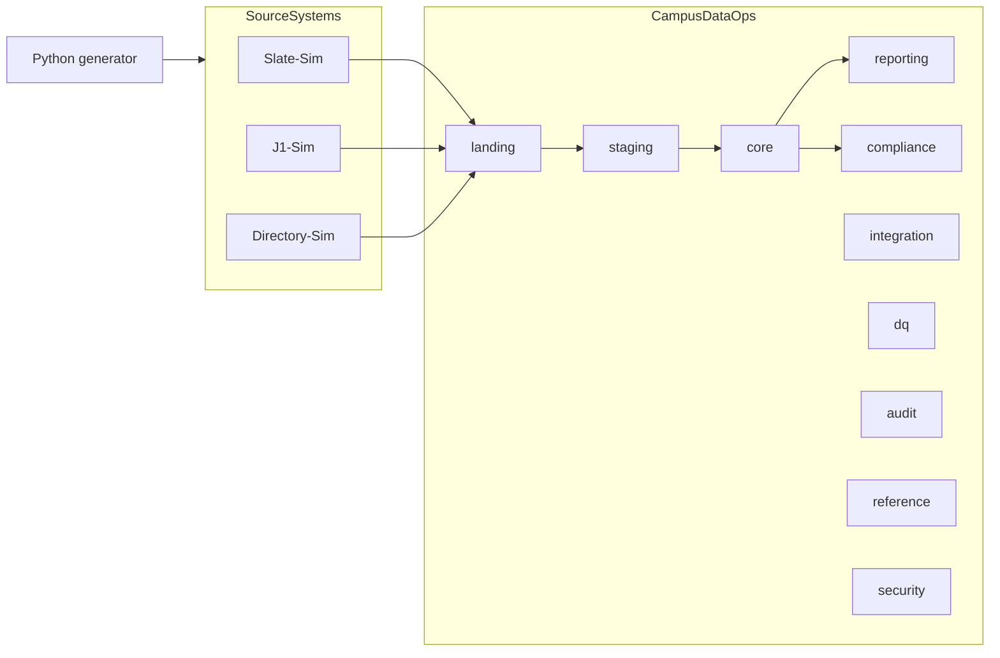

# campus-data-hub

**Campus Data Operations & Compliance Hub**: a SQL Server data platform that simulates a
community college's admissions-to-student data operations, built entirely on synthetic data.

> J1-Sim and Slate-Sim are original educational models created from public product descriptions
> and do not reproduce proprietary vendor schemas, code, or confidential institutional data.

This is an independent portfolio simulation. It is not affiliated with any college or vendor, and
it makes no claim of administering Slate or Jenzabar. Every person, email address, phone number
and identifier in it is fabricated.

## What exists today (Part 1: foundation)

| Area | Implemented |
|---|---|
| Environment | Docker Compose SQL Server 2022 Developer with SQL Server Agent, health check and persistent volume |
| Source simulators | `SourceSystems` database: Slate-Sim (admissions CRM), J1-Sim (SIS) and Directory-Sim (identity) |
| Operations database | `CampusDataOps` with ten layered schemas, governed reference data, batch/step/error audit tables and landing batch-control procedures |
| Synthetic data | Deterministic Python generator (fixed seed, `example.com` emails, `555-01xx` phones, no SSNs) with six named edge cases |
| Quality gates | pytest, Ruff, SQLFluff, GitHub Actions build/deploy/smoke pipeline |
| Documentation | System context, ERD, glossary, source-to-target mapping, ADR-002 |

Integration, matching, reconciliation (Part 2), reporting, compliance and security (Part 3), and
performance tuning and release hardening (Part 4) follow the plan in [BLUEPRINT.md](BLUEPRINT.md).

## Architecture



See [docs/architecture/system-context.md](docs/architecture/system-context.md) and
[docs/architecture/erd.md](docs/architecture/erd.md).

## Prerequisites

| Tool | Notes |
|---|---|
| Docker Desktop with Compose v2 | On Apple Silicon enable *Settings → General → Use Rosetta for x86_64/amd64 emulation*; the SQL Server image is amd64-only |
| .NET SDK 8 or later | Builds the SDK-style SQL projects (`Microsoft.Build.Sql`) |
| SqlPackage | `dotnet tool install -g microsoft.sqlpackage`, with `~/.dotnet/tools` on `PATH` |
| sqlcmd | `brew install sqlcmd` (go-sqlcmd) or `mssql-tools18` |
| Microsoft ODBC Driver 18 for SQL Server | Required by `pyodbc` |
| Python 3.12 and [uv](https://docs.astral.sh/uv/) | Python environment and dependency management |
| GNU Make | Runs the commands below |

## Setup

```bash
cp .env.example .env
```

Edit `.env` and set `MSSQL_SA_PASSWORD` (at least 8 characters with upper, lower, digit and
symbol; avoid `$`, which Make expands). `.env` is git-ignored.

```bash
make bootstrap
```

`bootstrap` checks tools, starts SQL Server and waits for it to be healthy, builds both DACPACs,
publishes them, loads the synthetic sources and runs the smoke test. It is safe to rerun.

## Commands

| Command | Purpose |
|---|---|
| `make up` / `make down` | Start or stop SQL Server (data is kept) |
| `make build` | Build both SQL projects into DACPACs |
| `make deploy` | Publish both DACPACs (blocks on possible data loss) |
| `make seed` | Replace simulator data with the deterministic dataset (`SEED=` and `SCALE=` override) |
| `make smoke` | Run the post-deployment smoke test |
| `make test` | Python tests that need no database |
| `make test-db` | Python tests against the deployed local database |
| `make lint` / `make fmt` | Lint or format Python and SQL |
| `make clean CONFIRM=1` | Delete the container **and its data volume** |
| `uv run campus-ops summary` | Generate in memory; print row counts and dataset fingerprint |
| `uv run campus-ops edge-cases` | List the deliberate edge cases and their fixed identifiers |

### If SqlPackage reports a missing .NET runtime

The SqlPackage tool targets a newer .NET 10 patch than some SDK installs provide. Either update the
.NET SDK, or run its bundled .NET 8 build on your current runtime:

```bash
export SQLPACKAGE="dotnet exec --roll-forward Major $(find ~/.dotnet/tools/.store/microsoft.sqlpackage -path '*net8.0*' -name sqlpackage.dll | head -1)"
```

## Synthetic data

The generator is seeded per domain (`<seed>:<domain>`) and uses a fixed simulation date of
2026-09-01, so the same seed and scale always produce the same fingerprint. The default scale
creates roughly 2,000 SIS people and 600 applicants. Six edge cases use fixed identifiers:

| Code | Scenario |
|---|---|
| `DUPLICATE_SIS_PERSON` | Two SIS people (9000001, 9000002) for the same human |
| `AMBIGUOUS_MATCH` | Admitted applicant whose email and birth date match two SIS people (twins) |
| `MISSING_PROGRAM` | Admitted application with no program choice |
| `INVALID_TERM` | Admitted application for entry term 2031FA |
| `MALFORMED_EMAIL` | Applicant email with a doubled `@` |
| `ORPHAN_DIRECTORY_ACCOUNT` | Student directory account for nonexistent SIS person 9000099 |

## Repository layout

```text
database/SourceSystems.Database/     Simulator schemas (one object per file)
database/CampusDataOps.Database/     Operations database, reference seed, smoke test
pipelines/campus_ops/                Python package: settings, connections, generators, loader, CLI
tests/python/                        pytest suites (database tests are marked `db`)
docs/                                Architecture, specifications, decisions, AI usage log
.github/workflows/validate.yml       CI: lint, test, build, deploy to a disposable SQL Server
```

## Security notes

Secrets live only in `.env` locally and are generated at runtime in CI. Part 1 deploys and seeds
as `sa` on a local container; least-privilege roles arrive in Part 3. See [SECURITY.md](SECURITY.md).

## License

[MIT](LICENSE)
