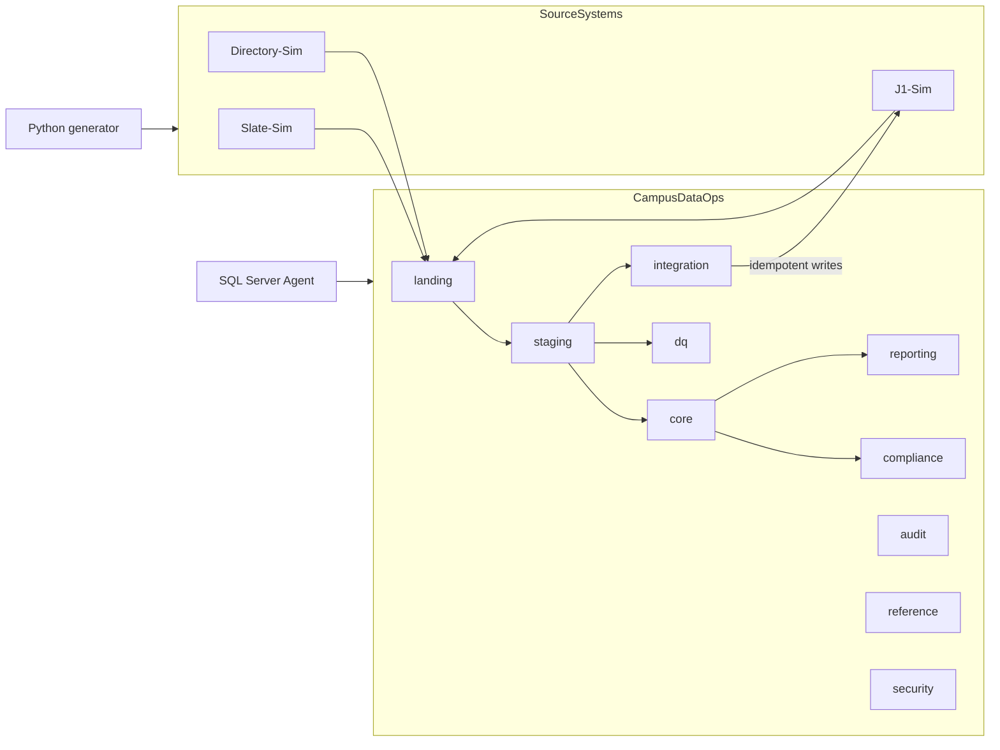

# campus-data-hub

**Campus Data Operations & Compliance Hub**: a SQL Server data platform that simulates a
community college's admissions-to-student data operations, built entirely on synthetic data.

> J1-Sim and Slate-Sim are original educational models created from public product descriptions
> and do not reproduce proprietary vendor schemas, code, or confidential institutional data.

This is an independent portfolio simulation. It is not affiliated with any college or vendor, and
it makes no claim of administering Slate or Jenzabar. Every person, email address, phone number
and identifier in it is fabricated.

## What exists today (Parts 1 to 3)

| Area | Implemented |
|---|---|
| Environment | Docker Compose SQL Server 2022 Developer with SQL Server Agent, health check and persistent volume |
| Source simulators | `SourceSystems` database: Slate-Sim (admissions CRM), J1-Sim (SIS, with a simulated import interface) and Directory-Sim (identity) |
| Synthetic data | Deterministic Python generator (fixed seed, `example.com` emails, `555-01xx` phones, no SSNs) with six named edge cases |
| Landing | Append-only, incremental loads with watermarks and SHA-256 row hashes; one atomic batch per source |
| Staging | Raw values kept beside normalized names, emails, phones and postal codes; validation codes for terms, programs, required fields and duplicates |
| Matching | Ordered deterministic rules (crosswalk, SIS ID, email + birth date; name + birth date + postal code review-only), all candidates and evidence stored, database constraints that stop ambiguous auto-merges |
| Exceptions | Governed lifecycle (`OPEN` to `CLOSED`) with an action history for every change, analyst identity resolution and automatic retry |
| Outbound | Idempotent queue to J1-Sim: one transaction per write, attempt limits, crosswalk written with the write |
| Reconciliation | One outcome per eligible application, outcomes that must add up to the eligible count, target confirmation in J1-Sim, entity counts |
| Data quality | Eighteen metadata-driven rules with owners, severities, a scorecard and owner dispositions |
| Orchestration | Eight-step nightly pipeline as a SQL Server Agent job and a Python CLI, with explicit recovery runs |
| Reports | Six specified reports (census, aid packaging, account aging, academic progress, masked exception worklist, leadership KPIs) over conformed `core` views, every measure registered with an owner and lineage |
| Census | Immutable, rule-versioned census snapshots with checksums; census reports and KPIs never read live data ([ADR-003](docs/decisions/ADR-003-census-snapshots.md)) |
| Extracts | Recorded extract runs with exact CSV lines, SHA-256, control totals (fail or warn, never hidden), two-person approval and audited export; four IPEDS-aligned aggregate mock extracts (educational simulations) |
| Security | Eight least-privilege roles tested against a permission matrix, raw layers denied, masked surrogate keys, program-scoped row-level security, access and permission-change auditing |
| Scheduling | Four SQL Server Agent jobs: nightly integration, daily operational reports, weekly quality report, census and compliance |
| Power BI | A star schema (`bi`) with data-as-of status, and a PBIP/TMDL semantic model with measures and roles. **Not yet opened in Power BI Desktop**: report pages and screenshots are pending a Windows session ([steps](docs/powerbi/WINDOWS-BUILD-STEPS.md)) |
| Quality gates | tSQLt (131 tests), pytest (100 unit and 35 database tests), Ruff, SQLFluff, GitHub Actions |
| Documentation | Specifications, report catalog, IPEDS mapping, three ADRs, ERDs, data dictionary, operations handbook, five runbooks and a [traceability matrix](docs/TRACEABILITY.md) |

Performance tuning and release hardening (Part 4) follow the plan in [BLUEPRINT.md](BLUEPRINT.md).

## Architecture



Reports read only `core`, `compliance` and `reference`; Power BI reads only the masked `bi`
schema. See [docs/architecture/system-context.md](docs/architecture/system-context.md) and
[docs/architecture/erd.md](docs/architecture/erd.md).

## Prerequisites

| Tool | Notes |
|---|---|
| Docker Desktop with Compose v2 | On Apple Silicon enable *Settings → General → Use Rosetta for x86_64/amd64 emulation*; the SQL Server image is amd64-only |
| .NET SDK 10 | Builds the SDK-style SQL projects (`Microsoft.Build.Sql` 2.3); verified with 10.0.203 |
| curl, shasum, unzip | Download and verify tSQLt for `make test-sql` (present on macOS and Ubuntu) |
| SqlPackage | `dotnet tool install -g microsoft.sqlpackage`, with `~/.dotnet/tools` on `PATH` |
| sqlcmd | `brew install sqlcmd` (go-sqlcmd) or `mssql-tools18` |
| Microsoft ODBC Driver 18 for SQL Server | Required by `pyodbc` |
| Python 3.12 and [uv](https://docs.astral.sh/uv/) | Python environment and dependency management |
| GNU Make | Runs the commands below |

## Setup

```bash
cp .env.example .env
```

Edit `.env` and set `MSSQL_SA_PASSWORD` (at least 8 characters with upper, lower, digit and
symbol; avoid `$`, which Make expands). `.env` is git-ignored.

```bash
make bootstrap
```

`bootstrap` checks tools, starts SQL Server and waits for it to be healthy, builds both DACPACs,
publishes them, loads the synthetic sources and runs the smoke test. It is safe to rerun.

## Commands

| Command | Purpose |
|---|---|
| `make up` / `make down` | Start or stop SQL Server (data is kept) |
| `make build` | Build both SQL projects into DACPACs |
| `make deploy` | Publish both DACPACs (blocks on possible data loss) |
| `make seed` | Replace simulator data with the deterministic dataset (`SEED=` and `SCALE=` override) |
| `make smoke` | Run the post-deployment smoke test |
| `make nightly` | Run the nightly integration pipeline once and print its reconciliation |
| `make recover FAILED_BATCH=<id> AT=<STEP>` | Resume a failed run at a step ([runbook](docs/runbooks/failed-job-recovery.md)) |
| `make agent-install` / `make agent-run [JOB=...]` | Create the four SQL Server Agent jobs / run one (nightly by default) and wait for the outcome |
| `make extracts` | Run the CENSUS, DAILY and WEEKLY extract schedules now (same procedure as the Agent jobs) |
| `make export RUN=<id> [PUBLIC=1]` | Write a stored extract run and its manifest to `out/extracts` (or a suppressed public copy to `sample-output`) |
| `make powerbi-model` | Regenerate the PBIP semantic model (TMDL) from the deployed `bi` views |
| `make reset-ops CONFIRM=1` | Development only: delete all operational data (landing through audit) |
| `make test` | Python tests that need no database |
| `make test-db` | Python tests against the deployed databases, including end-to-end pipeline scenarios |
| `make test-sql` | tSQLt database unit tests (installs tSQLt into the local database; writes `out/tsqlt-results.xml`) |
| `make lint` / `make fmt` | Lint or format Python and SQL |
| `make clean CONFIRM=1` | Delete the container **and its data volume** |
| `uv run campus-ops summary` | Generate in memory; print row counts and dataset fingerprint |
| `uv run campus-ops edge-cases` | List the deliberate edge cases and their fixed identifiers |
| `uv run campus-ops run-summary --batch <id>` | Print a run's status and reconciliation counts |
| `uv run campus-ops generate-extract --type <TYPE> [--period <P>]` | Generate one checked extract run |

### If SqlPackage reports a missing .NET runtime

The SqlPackage tool targets a newer .NET 10 patch than some SDK installs provide. Either update the
.NET SDK, or run its bundled .NET 8 build on your current runtime:

```bash
export SQLPACKAGE="dotnet exec --roll-forward Major $(find ~/.dotnet/tools/.store/microsoft.sqlpackage -path '*net8.0*' -name sqlpackage.dll | head -1)"
```

### If Python reports "OpenSSL library could not be loaded" (macOS)

Homebrew's `msodbcsql18` can install OpenSSL 4 and point the unversioned `openssl` alias at it, but
ODBC Driver 18 loads only OpenSSL 1.x or 3.x. The Makefile handles this automatically: when
`openssl@3` is installed, Python commands run with `DYLD_LIBRARY_PATH` set to its libraries. If you
run Python outside Make, use the same prefix:

```bash
DYLD_LIBRARY_PATH="$(brew --prefix openssl@3)/lib" uv run python -m campus_ops.cli summary
```

## Demonstration

After `make bootstrap`:

```bash
make nightly
```

The first run lands about 43,000 source rows, writes 247 new people and 51 returning people to
J1-Sim, and rejects 27 applications with reasons: review-only matches, the ambiguous twins, an
inactive or missing program and an unknown term. Run it again and nothing changes: every
written application is `UNCHANGED`, and the run still reconciles. The
[exception reconciliation runbook](docs/runbooks/exception-reconciliation.md) shows how to
resolve the ambiguous match so the next run writes it. The
[failed-job recovery runbook](docs/runbooks/failed-job-recovery.md) walks through a failed run
and its recovery.

Then the reporting layer:

```bash
make extracts
```

The CENSUS schedule captures a snapshot for every term whose census date has passed (they are
late captures for the historical terms, and `CaptureLagDays` says so), then produces the census
and IPEDS-aligned extracts. The DAILY and WEEKLY schedules produce the operational reports. Every
run is recorded in `compliance.ExtractRun` with its controls. Two IPEDS runs report `WARNING`:
fall headcount grows 135% from 2024FA, the partial first year of the synthetic data, which is
above the 20% prior-period limit. The warning is recorded, not hidden. To write a file:

```bash
make export RUN=<extract run id>
```

The [recurring report runbook](docs/runbooks/recurring-report-production.md) covers review,
approval and delivery.

## Synthetic data

The generator is seeded per domain (`<seed>:<domain>`) and uses a fixed simulation date of
2026-09-01, so the same seed and scale always produce the same fingerprint. The default scale
creates roughly 2,000 SIS people and 600 applicants. Six edge cases use fixed identifiers:

| Code | Scenario | What the pipeline does |
|---|---|---|
| `DUPLICATE_SIS_PERSON` | Two SIS people (9000001, 9000002) for the same human | Data-quality failure for both, grouped under 9000001 |
| `AMBIGUOUS_MATCH` | Admitted applicant whose email and birth date match two SIS people (twins) | `AMBIGUOUS_MATCH` exception; never auto-merged |
| `MISSING_PROGRAM` | Admitted application with no program choice | `MISSING_REQUIRED_FIELD` exception; resolves itself when the program is added |
| `INVALID_TERM` | Admitted application for entry term 2031FA | `INVALID_ENTRY_TERM` exception |
| `MALFORMED_EMAIL` | Applicant email with a doubled `@` | Non-blocking exception; written to J1-Sim without the email |
| `ORPHAN_DIRECTORY_ACCOUNT` | Student directory account for nonexistent SIS person 9000099 | Data-quality failure `NOT_A_J1_PERSON` |

## Repository layout

```text
database/SourceSystems.Database/     Simulator schemas and the J1-Sim import interface (one object per file)
database/CampusDataOps.Database/     Operations database: landing, staging, core, integration, dq, reporting, compliance, bi, security, audit, reference
database/CampusDataOps.Tests/        tSQLt test classes (installed only into development and CI databases)
automation/sql-agent/                SQL Server Agent job definitions and a run-and-wait script
pipelines/campus_ops/                Python package: settings, connections, generators, pipeline, extract export, CLI
powerbi/                             PBIP project: TMDL semantic model, measures, roles (not yet opened in Desktop)
tests/python/                        pytest suites (database tests are marked `db`)
docs/                                Architecture, specifications, decisions, runbooks, AI usage log
.github/workflows/validate.yml       CI: lint, test, build, deploy to a disposable SQL Server
```

## Security notes

Secrets live only in `.env` locally and are generated at runtime in CI. Developers deploy, seed and
run the pipeline as `sa` on a local container; people and reports use eight least-privilege roles
([security model](docs/architecture/security-model.md)). Worklists, match evidence and
data-quality results hold identifiers and codes, not personal values, and only aggregate,
small-cell-suppressed extracts may be copied to `sample-output/`. The design shows controls
informed by FERPA and GLBA; a portfolio repository is not "compliant" with either. See
[SECURITY.md](SECURITY.md).

## License

[MIT](LICENSE)
