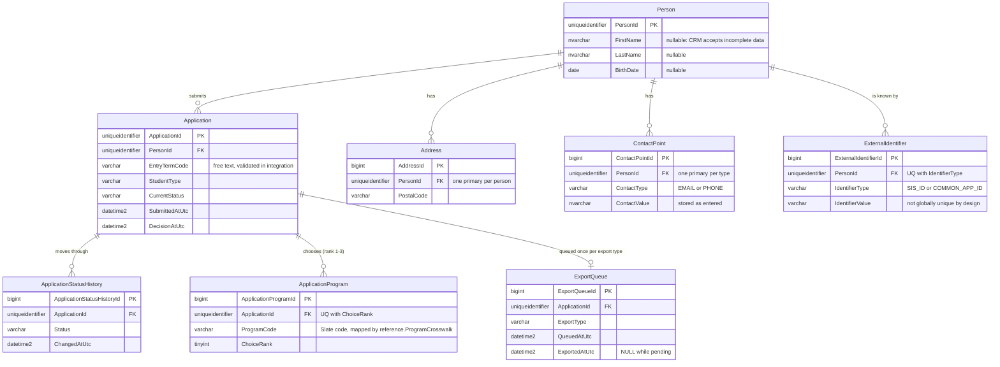
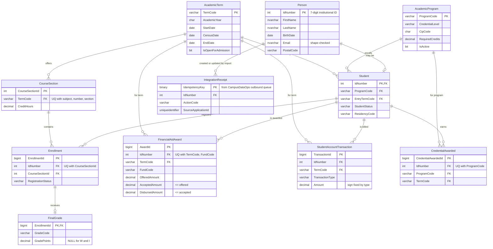
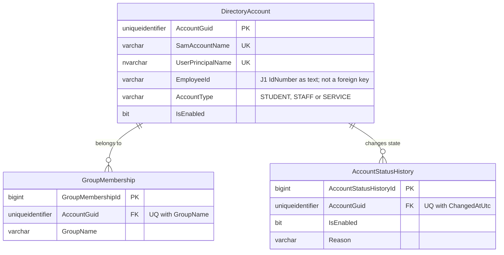
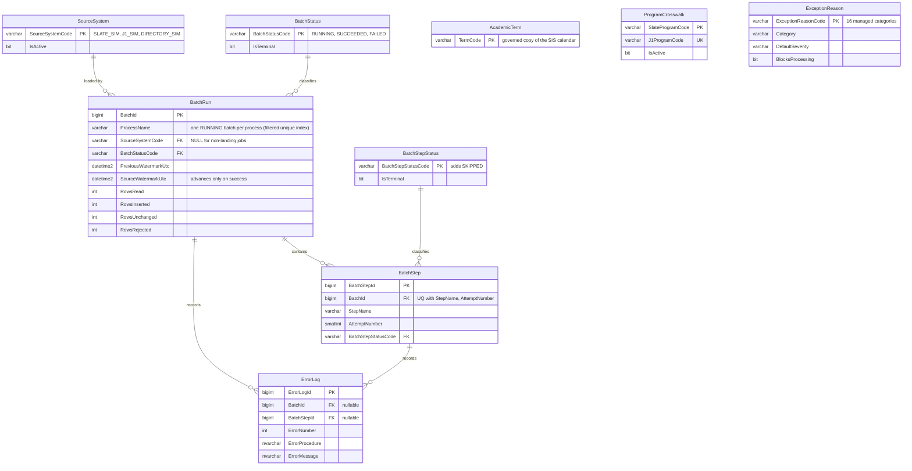
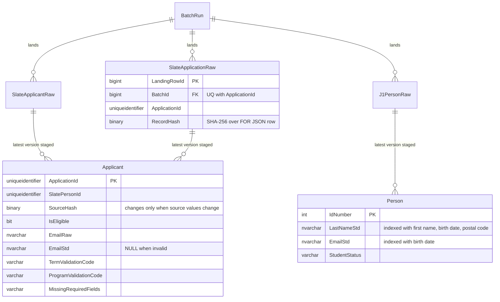
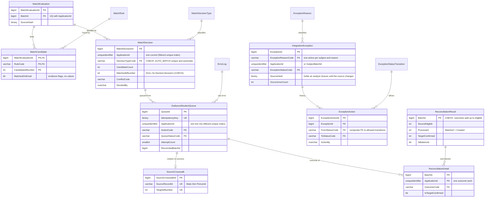
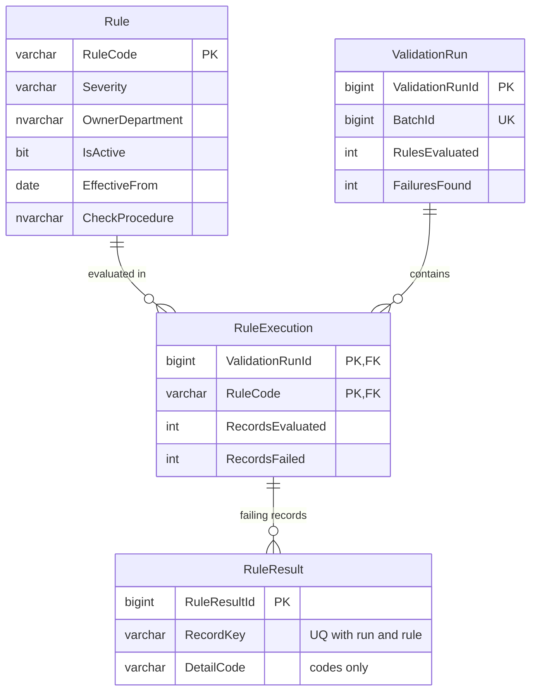

# Entity-relationship diagrams

Diagrams show keys and the columns that matter for relationships and integration. Every table
also carries `CreatedAtUtc` and `UpdatedAtUtc` (UTC `datetime2(3)`) unless it is an append-only
history table, which carries `CreatedAtUtc` only. The `.sql` files under `database/` are the
authoritative definitions.

## Slate-Sim (admissions CRM)

## J1-Sim (student information system)

`IntegrationReceipt` belongs to the simulated import interface (Part 2): a replayed key returns
the original ID number, so a lost acknowledgement cannot create a second person.

## Directory-Sim (identity)

## CampusDataOps (Part 1 objects)

Part 2 adds `ParentBatchId` (a landing batch's pipeline run) and `RecoveryOfBatchId` (the FAILED
run a recovery run resumes, at most one) to `audit.BatchRun`.

## CampusDataOps landing and staging (Part 2)

Every landing table has the same lineage columns (`LandingRowId` PK, `BatchId` FK, constant
`SourceSystemCode`, `SourceRecordId`, `SourceUpdatedAtUtc`, `RecordHash`, `RequestId`,
`IngestedAtUtc`) and a unique index on (key, `BatchId`). Staging rows point at the landed row
they were built from.

The same pattern applies to `J1EnrollmentRaw`, `J1FinancialAidRaw`, `J1AccountTransactionRaw` and
`DirectoryAccountRaw` (staged one-for-one) and to `J1AccountControlTotal` (read by data quality).

## CampusDataOps integration (Part 2)

`ReconciliationEntityCount` (per run and entity: landed vs staged keys) sits beside
`ReconciliationResult`.

## CampusDataOps data quality (Part 2)

