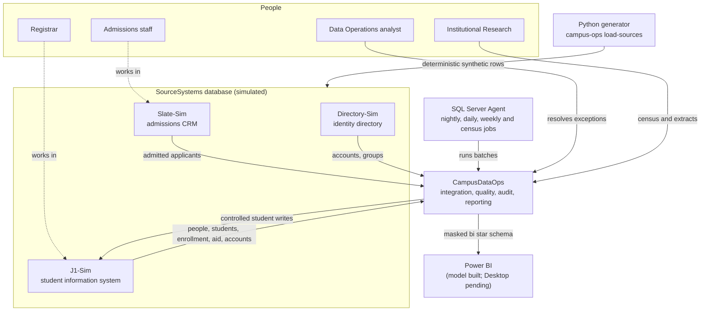

# System context

campus-data-hub simulates the data operations of a fictional Massachusetts community college.
Three simulated source systems feed one operations database, which later publishes reports and
IPEDS-aligned extracts. All data is synthetic.

## Context diagram

Solid arrows are data flows; dotted arrows show which office owns each source. Elements marked
with a later part are designed in [BLUEPRINT.md](../../BLUEPRINT.md) and not yet built.

## Systems

| System | Role | Owner (simulated) | Implemented |
|---|---|---|---|
| Slate-Sim | Admissions CRM: people, applications, status history, program choices, contact points, external identifiers, export queue | Admissions | Part 1 |
| J1-Sim | Authoritative SIS: people, students, terms, programs, sections, enrollment, grades, aid, ledger, credentials | Registrar, Financial Aid, Student Accounts | Part 1 |
| Directory-Sim | Identity: accounts, group membership, enable/disable history | IT Identity Services | Part 1 |
| CampusDataOps | Integration hub and reporting platform: reference, audit, landing, staging, core, integration, data quality, reporting, compliance, security and bi | Data Operations | Parts 1–3 |
| SQL Server Agent | Scheduling and job history | Data Operations | Nightly integration (Part 2); daily reports, weekly quality and census jobs (Part 3) |
| Power BI | Operational and leadership reporting | Institutional Research | Part 3: semantic model as text; report pages pending a Windows session |

## Trust boundaries

- **Simulator to hub.** CampusDataOps treats every source as untrusted input. Cross-system
  references (program codes, entry terms, SIS IDs in the CRM, `EmployeeId` in the directory) are
  not foreign keys. They are validated during integration, which is why edge cases such as an
  invalid term or an orphan account can exist in the sources.
- **Hub to SIS.** Writes back to J1-Sim go only through `J1Sim.usp_ReceiveAdmittedApplicant`, a
  simulated import interface with idempotency receipts, called from one adapter procedure.
- **Reporting.** Consumers read curated `reporting`, `compliance` and `bi` objects through
  least-privilege roles. `landing`, `staging` and `core` are denied to every role
  ([security model](security-model.md)).

## Runtime environment

| Component | Local | CI |
|---|---|---|
| SQL Server 2022 Developer | Docker container `campus-data-hub-sql` (amd64; Rosetta on Apple Silicon) | Same Compose file on `ubuntu-24.04` |
| Schema deployment | `dotnet build` and SqlPackage publish of two DACPACs | Same, via `make bootstrap` |
| Data | `campus-ops load-sources` replaces simulator data in one transaction | Same |
| Scheduling | SQL Server Agent job from `make agent-install` | Same; CI runs the job once with `make agent-run` |
| Verification | `make smoke`, `make test`, `make test-db`, `make test-sql` | Same, plus a full-history secret scan |
