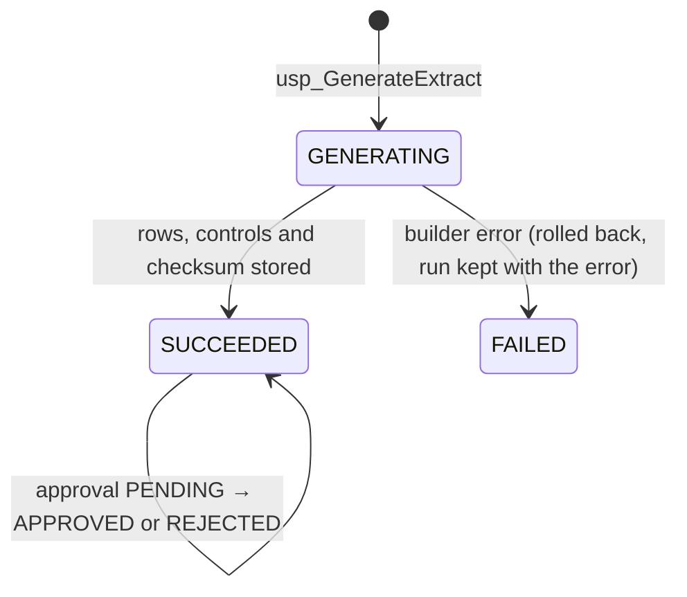

# Extract runs and controls

**Owner:** Institutional Research (IPEDS extracts) and Data Operations (the mechanism)
**Implements:** `compliance.usp_GenerateExtract`, the `compliance.usp_BuildExtract*` builders,
`compliance.usp_ValidateExtractControlTotals`, `compliance.usp_ApproveExtract`,
`compliance.usp_GetExtractForExport` and the Python `campus-ops export` command

Every recurring output is produced as an **extract run**: a recorded, checked and immutable set
of CSV lines held in the database. Python writes files only from a stored run. It never queries
reports itself.

## Lifecycle



| Column (`compliance.ExtractRun`) | Meaning |
|---|---|
| `ExtractTypeCode` | One of the types in `reference.ExtractType` (grain, owner, security class, builder and generator version) |
| `ReportingPeriod`, `PeriodStartDate` | Term code, academic or aid year, or as-of date; the start date orders periods. Term codes do not sort correctly as text (`2026SP` sorts after `2026FA`) |
| `ParametersJson` | The parameters the run was built with |
| `SourceBatchId` | The last successful nightly run when the extract was built (lineage) |
| `CensusSnapshotId` | The snapshot used, for census-based types |
| `ExtractStatusCode` | `GENERATING`, `SUCCEEDED` or `FAILED` |
| `ValidationStatusCode` | `PASSED`, `WARNING` or `FAILED`, from the control totals |
| `ApprovalStatusCode` | `PENDING`, `APPROVED` or `REJECTED`. The approver must differ from the requester, and a run that failed validation cannot be approved. Both rules are `CHECK` constraints |
| `LineCount`, `DataRowCount` | Lines including the header, and data rows |
| `ContentSha256` | SHA-256 of the exact file content (below) |
| `GeneratorVersion` | Builder version from `reference.ExtractType`, raised whenever a builder's output changes |
| `RequestedBy`, `GeneratedAtUtc`, `CompletedAtUtc` | Who and when |

A run is never updated after it succeeds, except for its approval fields. Its lines and control
totals cannot be changed or deleted, which triggers enforce. Re-running a period creates a new
run, and the earlier one stays visible.

## File content and checksum

The builder writes one row per line into `compliance.ExtractRow`, with line 1 as the header.
Values are formatted by `compliance.fn_CsvField`:

- NULL becomes an empty field.
- A value containing a comma, a double quote, a carriage return or a line feed is enclosed in
  double quotes, with any inner double quotes doubled (RFC 4180).
- Decimals use a period and their declared scale. Dates are `YYYY-MM-DD`.

The file content is the lines joined with a line feed (`\n`), plus a final line feed, encoded
as UTF-8 without a byte-order mark. `ContentSha256` is computed in SQL over exactly those bytes.
`campus-ops export` writes the same bytes and refuses to write a manifest unless the file's
SHA-256 equals `ContentSha256`. A drift in either implementation therefore fails the export
and the contract tests.

## File naming and manifest

```
<extract type, lower case>_<reporting period>_run<run id, 6 digits>.csv
<same stem>.manifest.json
```

For example: `ipeds_fe_2026FA_run000042.csv`. The manifest is UTF-8 JSON with keys
`extract_run_id`, `extract_type`, `reporting_period`, `source_batch_id`,
`census_snapshot_id`, `generated_at_utc`, `generator_version`, `row_count` (data rows),
`columns`, `sha256`, `validation_status`, `approval_status`, `control_totals` (code, expected,
actual, prior, outcome) and `security_class`.

## Control totals

Each builder writes its controls into `compliance.ExtractControlTotal`:

| Kind | Outcome when broken |
|---|---|
| **Reconciliation:** `ExpectedValue` is computed independently of the extract rows (for example, from the snapshot header or `core`), and `ActualValue` is computed from the rows | `FAIL` |
| **Subtotal:** parts must add up to the total | `FAIL` |
| **Rule:** a cited rule, for example 12-month headcount ≥ fall headcount | `FAIL` |
| **Prior period:** `ActualValue` is compared with the same control in the latest earlier successful run of the same type; for term periods, the latest earlier term of the same term type (fall with fall). The allowed change is in `compliance.ControlThreshold` | `WARN` |

`compliance.usp_ValidateExtractControlTotals` sets every outcome and the run's validation status:
`FAILED` if any control failed, otherwise `WARNING` if any warned, otherwise `PASSED`. Failures
and warnings are stored and shown. They never stop the run being recorded, and they are never
overwritten.

## Auditing

`audit.AccessEvent` records these, with the database user, the original login and the time:

- `EXTRACT_GENERATE`: every generation. `IsPrivileged = 1` for confidential student-level types.
- `EXTRACT_EXPORT`: every call to `usp_GetExtractForExport`, which is the only way Python reads
  lines.
- `EXTRACT_APPROVE` and `EXTRACT_REJECT`.

## Public copies

`campus-ops export --public` writes into `sample-output/` only. It refuses any type whose
`reference.ExtractType.IsPublicSafe` is 0, so student-level reports never leave the database
this way. In the copy, every count from 1 to 4 becomes `<5`, and the manifest records
`"suppression": "counts 1-4 shown as <5"`. **Assumption:** a small-cell threshold of 5, a
common disclosure-avoidance convention, not an NCES rule for submissions. The checksum in a
public manifest is the SHA-256 of the suppressed file, and it names the source run.

## Schedules

| Agent job | Schedule (UTC) | Extracts |
|---|---|---|
| `CampusDataOps - Daily Operational Reports` | Daily 06:00 | `ACCOUNT_AGING` (as of today), `AID_PACKAGING` (current aid year), `EXCEPTION_WORKLIST`, `LEADERSHIP_KPI` (current academic year) |
| `CampusDataOps - Weekly Quality Report` | Monday 07:00 | `DQ_SCORECARD`, `ACADEMIC_PROGRESS` (current term) |
| `CampusDataOps - Census and Compliance` | Daily 05:00 | Captures snapshots for terms whose census date has passed and that have none. Then generates `ENROLLMENT_CENSUS` for each newly captured term, `IPEDS_FE` for a newly captured fall term, and `IPEDS_E12`, `IPEDS_C` and `IPEDS_SFA` for the most recently completed academic year that has no successful run yet |

The schedules are rows in `reference.ExtractSchedule`. One procedure,
`compliance.usp_RunScheduledExtracts @ScheduleCode`, resolves default periods from today's date,
so a job never contains period logic.
