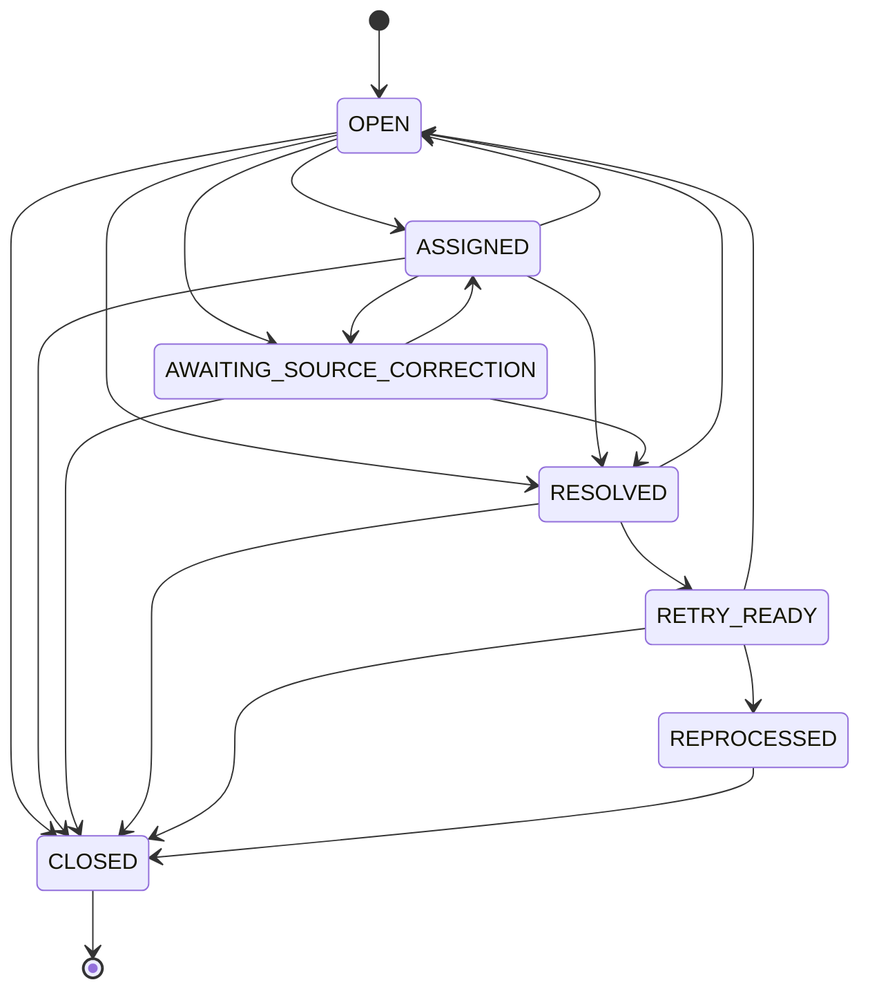

# Integration controls

**Owner:** Data Operations
**Scope:** validation exceptions, the exception lifecycle, the outbound student queue, the
simulated J1-Sim import interface, reconciliation and the nightly pipeline.
Matching itself is specified in [matching-rules.md](matching-rules.md).

## Validation exceptions

Raised for eligible applications from `staging.Applicant` flags during the `MATCH` step.
Whether a reason blocks processing is read from `reference.ExceptionReason.BlocksProcessing`,
not hard-coded.

| Reason | Condition | Blocks | Detail code |
|---|---|---|---|
| `MISSING_REQUIRED_FIELD` | First name, last name, birth date, entry term or first program choice is missing | Yes | Comma-separated field list, for example `BIRTH_DATE,PROGRAM` |
| `INVALID_PROGRAM` | First program choice is not in `reference.ProgramCrosswalk`, or maps to an inactive program | Yes | `NOT_IN_CROSSWALK` or `INACTIVE` |
| `INVALID_ENTRY_TERM` | Entry term is not in `reference.AcademicTerm`, or is closed for admission | Yes | `UNKNOWN_TERM` or `CLOSED_TERM` |
| `DUPLICATE_APPLICATION` | Another eligible application exists for the same Slate-Sim person and entry term; every application in the group is blocked because the system cannot know which one is intended | Yes | `GROUP_SIZE:<n>` |
| `INVALID_CONTACT_FORMAT` | Email or phone present but invalid | No | `EMAIL`, `PHONE` or `EMAIL,PHONE` |

A non-blocking exception does not stop the application: it is processed without the invalid
value (for example, J1-Sim receives no email).

## Exception lifecycle

One **active** exception exists per source record and reason. A filtered unique index enforces
it. A repeat of the same condition updates `LastSeenBatchId` and `OccurrenceCount` instead of
creating a new row; within one batch the update happens at most once, so reruns are idempotent.

Allowed transitions live in `reference.ExceptionStatusTransition`. Every change is made by
`integration.usp_TransitionException` and writes an `integration.ExceptionAction` row with the
previous and new status, actor, time, reason and optional note. The action table's
(from, to) pair is a foreign key to the allowed-transition table, so a disallowed transition
cannot be recorded even by code that bypasses the procedure.

| Status | Meaning | Who moves it here |
|---|---|---|
| `OPEN` | Raised, or reopened because the condition came back | System |
| `ASSIGNED` | An analyst owns it | Analyst |
| `AWAITING_SOURCE_CORRECTION` | The fix must be made in Slate-Sim or J1-Sim | Analyst |
| `RESOLVED` | An analyst recorded a resolution, or the system saw the condition disappear | Analyst or system |
| `RETRY_READY` | Approved for the next processing attempt | System, at the start of the `QUEUE` step |
| `REPROCESSED` | The application was written to J1-Sim after the retry | System, in the `PROCESS` step |
| `CLOSED` | Finished: confirmed in J1-Sim, no reprocessing needed, or the application is no longer eligible | System or analyst |

System rules:

- **Auto-resolve:** when an evaluated record no longer meets an active exception's condition,
  the exception moves to `RESOLVED` (only from `OPEN`, `ASSIGNED` or `AWAITING_SOURCE_CORRECTION`).
- **Reopen:** when the condition is present again for a `RESOLVED` or `RETRY_READY` exception,
  it moves back to `OPEN`.
- **Promote:** at the start of `QUEUE`, `RESOLVED` exceptions move to `RETRY_READY` when their
  reason blocks processing, otherwise to `CLOSED`.
- **Reprocessed:** a successful J1-Sim write moves the application's `RETRY_READY` exceptions to
  `REPROCESSED`; reconciliation moves them to `CLOSED` once the target is confirmed.
- **No longer eligible:** active exceptions on an application that is no longer eligible (for
  example, withdrawn) are `CLOSED`.
- An analyst cannot mark an identity exception (`AMBIGUOUS_MATCH`, `POSSIBLE_MATCH_REVIEW`,
  `IDENTITY_CONFLICT`) `RESOLVED` directly; it must go through `usp_ResolveExceptionMatch`, which
  records the identity decision at the same time.

## Outbound student queue

`integration.OutboundStudentQueue` holds one row per application and action. The payload is the
standardized staging values at queue time.

| Control | Rule |
|---|---|
| Idempotency key | SHA-256 of `SLATE_SIM|<ApplicationId>|<ActionCode>|<TargetIdNumber or empty>`; unique |
| One live row per application | Filtered unique index on `ApplicationId` where status is not `CANCELLED` |
| Decision change before sending | A `PENDING` or `FAILED_RETRYABLE` row whose key no longer matches the current decision is `CANCELLED`; a previously cancelled row with the same key is reactivated rather than duplicated |
| Payload refresh | Unsent rows take the latest staged values |
| Attempts | Each attempt increments `AttemptCount`; the default `MaxAttempts` is 3 |
| Failure | Rolls back that row's transaction, writes `audit.ErrorLog`, links it as `LastErrorLogId`, and sets `FAILED_RETRYABLE`, or `FAILED_PERMANENT` at the attempt limit |
| Permanent failure | Raises `OUTBOUND_WRITE_FAILURE`; resolving that exception resets the row to `PENDING` with `AttemptCount = 0` and `RetryGeneration + 1` |
| Step outcome | Rows are processed one at a time so one bad row cannot undo the others. If any attempt in a run fails, the `PROCESS` step fails after finishing the remaining rows, so an operator sees it |

Per-row processing is the documented exception to set-based SQL: each row is a separate write to
an external system with its own failure handling.

### Simulated J1-Sim import interface

`J1Sim.usp_ReceiveAdmittedApplicant` (in the SourceSystems database) stands in for the SIS's
import service.

- It records `J1Sim.IntegrationReceipt` keyed by the idempotency key. A replay with a known key
  returns the original ID number and writes nothing, so even a lost CampusDataOps commit cannot
  create a second person.
- It validates that the program is active and the entry term is open for admission.
- New people receive ID numbers from the integration block 8000000-8999999 (the highest existing
  number in the block plus one, under a range lock). The generator uses numbers from 2400001 and
  edge cases use 9000000-9000099.
- `CREATE_PERSON_STUDENT` creates the person and an `ACTIVE` student; `CREATE_STUDENT` adds an
  `ACTIVE` student to an existing person; `READMIT_STUDENT` reactivates an existing student with
  the new program and entry term.
- Residency is derived from the applicant's primary address: `MA` is `IN_STATE`, another US
  state is `OUT_OF_STATE`, a non-US country is `INTERNATIONAL`, and no state on a US address is
  treated as `IN_STATE`. **Project assumption** for the simulator, not a residency policy.

## Reconciliation

`integration.usp_ReconcileSlateToJ1` runs once per pipeline run and writes three levels of
evidence.

**Record level, `integration.ReconciliationDetail`:** one row per eligible application, with
exactly one outcome. The unique key (`BatchId`, `ApplicationId`) makes outcomes mutually
exclusive.

| Outcome | Rule, first match wins |
|---|---|
| `CREATED` | A `CREATE_PERSON_STUDENT` write succeeded and has not been reconciled before |
| `MATCHED` | A `CREATE_STUDENT` or `READMIT_STUDENT` write succeeded and has not been reconciled before |
| `UNCHANGED` | Written and reconciled in an earlier run; nothing new to do |
| `REJECTED` | Blocked by an active blocking exception; the reason is recorded |
| `PENDING` | In a controlled waiting state: queued, retryable, resolved and awaiting retry |

**Batch level, `integration.ReconciliationResult`:** counts per run. A `CHECK` constraint enforces
`SourceEligible = Unchanged + Matched + Created + Rejected + Pending`. `Processed` is
`Matched + Created`. `TargetConfirmed` counts processed rows whose J1-Sim receipt, person and
`ACTIVE` student with the expected program all exist.

**Entity level, `integration.ReconciliationEntityCount`:** for each staged entity, the number of
distinct source keys landed by successful batches equals the number of staged keys.

A run is **balanced** when `TargetConfirmed = Processed` and every entity count agrees. Otherwise
a `RECONCILIATION_COUNT_MISMATCH` exception is raised for the batch and the `NOTIFY` step fails.

## Nightly pipeline

Process name `NIGHTLY_INTEGRATION`; at most one run can be `RUNNING` (database-enforced).

| Order | Step | Procedure work | Atomicity |
|---|---|---|---|
| — | Start | `integration.usp_StartPipelineRun` opens the run | — |
| 1 | `LOAD` | Landing load for `SLATE_SIM`, `J1_SIM`, `DIRECTORY_SIM`, each its own landing batch linked by `ParentBatchId` | One transaction per source |
| 2 | `STAGE` | Standardize applicants, people, directory accounts, enrollments, aid, account transactions | One transaction per entity |
| 3 | `DATA_QUALITY` | Run every active `dq.Rule` | One transaction |
| 4 | `MATCH` | Validation exceptions, candidates, decisions, identity exceptions | One transaction |
| 5 | `QUEUE` | Promote resolved exceptions, apply exception retries, queue ready applications, `ALREADY_MATRICULATED` | One transaction |
| 6 | `PROCESS` | Write queued rows to J1-Sim | One transaction per row |
| 7 | `RECONCILE` | Record, batch and entity reconciliation | One transaction |
| 8 | `NOTIFY` | Publish the run summary; close the run `SUCCEEDED` only if balanced | — |

`integration.usp_RunPipelineStep` refuses to run a step unless every earlier step in the run is
`SUCCEEDED` or `SKIPPED`. A failed step is logged `FAILED` with an `audit.ErrorLog` row that names
the batch and step, and the run is closed `FAILED`.

**Recovery:** an operator opens a recovery run with
`integration.usp_OpenRecoveryRun @FailedBatchId, @ResumeAtStepCode`. It links the new run to the
failed one (`RecoveryOfBatchId`, at most one recovery per failed run), records the earlier steps
as `SKIPPED`, and the job is started at the chosen step. Every step works from database state
rather than from the failed run's in-memory progress, so any step is a safe recovery point.
